汉斯·舍尔曼 / 曼弗雷德·纽谢勒

**如何赢得****三连**

奥托·迈尔·维拉格·拉文斯堡 

图像来源： 

列支敦士登兰德斯博物馆， 瓦杜兹 p. 6 鲁特林格将军 -安泽格 p. 54.

展出的所有其他游戏作品、棋盘游戏和计划都来自慕尼黑巴伐利亚国家博物馆的藏品。其中一些取自乔治·希姆·赫伯的书：斯皮尔-格塞尔沙夫茨皮尔·奥斯·艾因姆·贾尔陶森德（德国昆斯特韦拉格），其中也详细描述了他们。

原始版

1980年© 奥托·迈尔·维拉格 

拉文斯堡 

封面照片： 芭芭拉 ·布鲁宁

插图： 海克·迪姆 

句子： 戈佩尔，拉文斯堡

印刷 和 加工： 埃布纳乌尔姆 

在德国印刷 

84 83 82 81 80 54321 ISBN 3-473-43039-0 

2 

内容

内容。。。。。。。。。。。。。。。。。。。。。。。。。。。。。。。。。。。。。。。。。。。。。。。。。。。。。。。。。。。。。。。。。。。。。。。。。。。。。。。。。。。。。。。。。。。。。。。。。。。。。。。。。。。。。。3

介绍。。。。。。。。。。。。。。。。。。。。。。。。。。。。。。。。。。。。。。。。。。。。。。。。。。。。。。。。。。。。。。。。。。。。。。。。。。。。。。。。。。。。。。。。。。。。。。。。。。。。。。。4

基本规则。。。......................................................................................7 建造一个三连13 一个三连关闭！在哪里抢劫?...................................................19

中心三连的问题。。。21

对手多了一枚棋子，怎么打?................................29 对三连的恐惧。。。.......................................................32

对不同职位的分析37

纠纷。。。。。。。。。。。。。。。。。。。。。。。。。。。。。。。。。。。。。。。。。。。。。。。。。。。。。。。。。。。。。。。。。。。。。。。。。。。。。。。。。。。。。。。。。.........44

获胜时：包围或抢劫?............................................47

飞棋。。。 49

决赛。。。。。。。。。。。。。。。。。。。。。。。。。。。。。。。。.....................................................................55

开口。。。。。。。。。。。。。。。。。。。。。。。。。。。。。。。。。。。。。。。。。。。。。。。。。。。。。。。。。。。。。。。。。。。。。。。。。。。。。。。。。。。。。。。。。。。。。。。。。61种不同的游戏..............................67 最重要的原则73

谁占优势？ 黑方还是白方？74

锦标赛的规则和准则76

车轮三连.............................................82 简单的三连85

三石三连游戏。。。。87 10石磨机游戏90

亚美尼亚三连，一个10石三连的游戏。。。92

拉斯克的梅勒..........................................98

钻石三连100

太阳三连。。。106

五角大楼的三连。。。108

六边形或蜂窝三连110

斯普林格 - 梅勒或吕塞尔斯皮尔.......................................113 国际象棋三连116

伟大的三连。。。119

房间或立方体三连。。。121

3骰子三连游戏。。。................................................122

​                                                        3

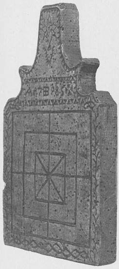 

三连棋盘 从 今年 

1785年从塞韦伦，在列支敦士登展出

兰德斯博物馆，瓦杜兹。 

介绍

这本书涉及一个游戏，每个人都知道，这也可以在几乎每个家庭找到：磨机游戏。 最古老的三连计划是在公元前1400年左右在埃及库尔纳神庙的屋顶上发现的。从这个留下，这个简单，但精致的战术游戏属于人类最古老的游戏。

在其他 痕迹 上被发现 

锡兰从国王马哈达西卡马哈-纳加（公元9-21年）的时间。 在欧洲，一个游戏计划躺在特洛伊的废墟中，一个游戏在爱尔兰的青铜时代墓地。               1880年，在挪威桑德峡湾附近的Gokstad附近发现了一个埋葬土堆，在土堆中发现了一艘有1000年历史的维京船，作为König的埋葬地。 除了许多其他项目，一个有

金在旅途中还给出了一个木雕三连游戏计划。

这个游戏的特殊优势是，它也可以很快地学习缺乏经验的玩家。 规则是很容易理解的，但仍然磨是不是

"儿童剧"。 

​      与   国际象棋     一样，

开局和终场技术适用，必须进行战术和战略，并有可能进行广泛的组合。因此，三连不是一个简单的来回推棋子，其中或多或少的运气决定！ 精心玩的游戏表明，各种技巧，陷阱和陷阱是可能的。 

许多人 到目前为止只在家庭圈已经测试了他们的艺术，经验在半专业人士的圈子里他们的蓝色奇观。

在下几章中，教授了关于开局的扎实理论——设置和结束游戏。 谁的评论

游戏指导在各种游戏部分已经阅读和练习，将有安全在演习的斯皮尔夫埃尔德。 

设置棋子时通常已经决定成败。 经验丰富的最终玩家在游戏的这一阶段快速飞棋到终点。 中间游戏不太可能做出决定。 然而，在拉扯时你必须小心。  

最小的错误可能是

失去比赛的领先优势。

由于游戏中有很多有趣的变种，因此您需要一些时间来获得足够的经验。 因此，初学者还不知道，谁形成三连时，投注几乎总是输，如果对手只玩。 谁知道你能在决赛中以3枚棋子战胜对手的4枚棋子？ 但是现在不要灰心丧胆，为游戏中的惊喜和有趣的组合而欢欣鼓舞。 读，并练习与这本书，那么你知道如何赢得三连。

在书中也有15个游戏变种的三连游戏，其中一些可以在同一时间表上玩。也有需要三维游戏计划的游戏。 就必要和本书的框架所允许的而言，不仅给出了这些变种的规则，而且还解释了理论和战术。 

|      |                                                              |
| ---- | ------------------------------------------------------------ |
|      | 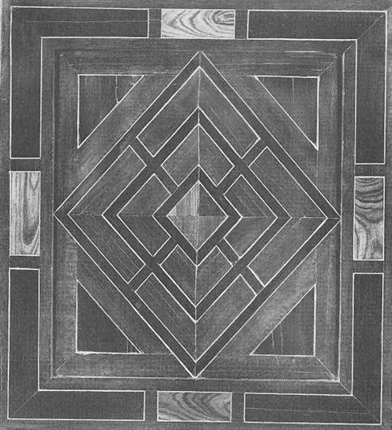 |

梅勒普兰· 艾恩斯 · 布雷特斯皮尔斯 · 奥斯·德国， 嗯 1600 年。田地     由     白木   和 黑方彩色橡木制成，与锡静脉接壤。    收藏巴伐利亚  国家博物馆，慕尼黑。

 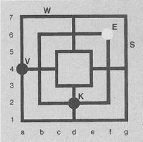基本规则

在三连游戏可以参加两个人。 你需要一个棋盘和九块白方和黑方的瓷砖。 

这种游戏材料可以购买       各种澳大利亚阿通根。 但你也可以用铅笔来制定计划

画一张纸，他与

钉成石板划伤角落（E），切在或犁它用一块木头或连接点（V）在沙子。作为一个游戏

棋子，然后服务，例如，

要写下这些地段， 

按钮，硬币，棋子，豆类，我们用在棋子或贝壳里。  

（名称） 。所有 水平

比赛一开始就是比赛场地

线（W） 被赋予数字李r。           玩家   坐在     对面，所有的垂直线（S）与， 一个   使用   表示字母。所以白石，其他都可以在            黑石   上任何一点。谁是第一个

游戏计划可以精确确定。 应该设置，决定很多。

通常白方开始。在其他游戏中，然后交替。 双方  的队友互相协商， 也可以参加比赛。 

在三连游戏的板，三个联锁    正方形   被记录下来，这是连接在两侧的四     行。   或者，在线路 的交叉点上放置一     枚棋子。所以你依靠

交叉口（K）， 上

 

由于在市售游戏计划上没有描述，因此应将这些计划贴在自粘标签上。 然后，你可以练习与这本书更容易，也记录游戏的过程与P艺术。  

在球场上是

**3**  **二 乘：** 

一个外部正方形与

得分

 

a1 g1 g7 a7

 

a .中间正方形与

积分b2 f2 f6 b6

 

内方（中心）与点

 

c3 e3 e5 c5

 

**4**  交叉口： 

 

f4 d2 b4 d6 

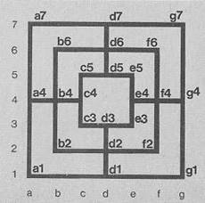 

 

外正方形上的4个交叉点：

 

g4 d1 a4 d7 

 

内正方形上的4个交叉点：

 

e4 d3 c4 d5 

 

在编写或记述游戏时，首先指示转弯的顺序，然后跟随白方移动，然后移动黑方。如果两个动作被注于一行，则它们由逗号隔开。白方总是第一位的。 如果你只是想写下黑方的移动，你把符号放在逗号之前

"-". 

 一些例子     应该说明     这一点： 

​      \1. b4     

 

白方将棋子设置为b4移动1

 

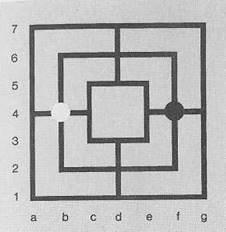 

 

​       第一 -    f4 

 

黑方将棋子设置为f4移动1

\17.      -a7-a4

 

黑方移动从a7 到 a4与他的棋子移动 17 。 标志- 意思是"拉起来。

 

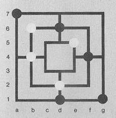 

\18. d2-b2/xa4    

 

白方移动从d2到b2移动18，形成三连，并击中对立的棋子在a4。标志/意思是"三连关闭"。 标志x表示"对手的棋子被击中"。

 

​             21.-d1-g4

 

黑方从d1飞棋到g4移动21。标志-也意味着"飞棋"。 

 

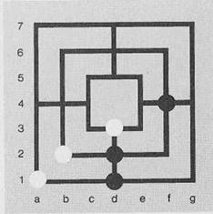 

 

一？符号后面表示一个坏的或错误的移动，a！ 表示一个好的或唯一正确的移动。 

设置的目的是建立一个三连或获得一个开始位置拉。 三连由3枚棋子组成，并排或垂直放置。 

 

如果你有一个三连，你可以拿走对手的任何棋子，但不是从封闭的三连。以下示例中对此非常清楚：

 

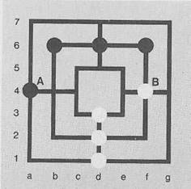 

 在这个位置，只有棋子A或棋子B可以带走或殴打。 

 拥有一枚棋子的棋手，因为他能够击中对手的棋子"有一个小的机会赢得比赛，只要他的棋子不被封锁任何地方。 如果他也成功地建造了第二个三连，而对手还没有一个，胜利是相当肯定的。 

然而，三连必须躺在战术上很好，可移动 - 即不包括在对手。 

 如果所有9枚棋子都设置和三连布局，他们可以再次打开和关闭拉。对手被反复拿走一枚棋子，直到最后只有自己的棋子可用，胜利是有保障的。 在许多情况下，对手给游戏之前， 

当他意识到战斗继续的绝望时， 他失去了棋子。 您只能拖动到下一个空置的连接线、拐角或交叉路口。 不能飞棋过拥有或r对手的棋子。 但是，要小心快速竖立三连，尤其是外部或内部方块上的三连，因为这些三连很容易被阻塞。  为了给自己尽可能多的行动自由，在中场首先占据两个交叉口是必要的。 

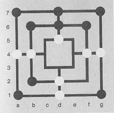 

 

在这个例子中，轮到布莱克了，但他不能用棋子画画，因为没有更多的空缺。他被监禁，并失去了，虽然er可以形成两个三连。

 

如果一个棋手只剩下三枚棋子，他可能会飞棋，而不是拉。他可以把剩下的棋子放在任何自由空间上。 这样做，他必须尽快创建一个三连，以减少对立的棋子的数量。 一旦到达临界点，对手自己只剩下四枚棋子，人们必须谨慎地决定何时和哪枚棋子要被击败。 必须防止对手的双磨机的形成，否则你一举输掉比赛。 

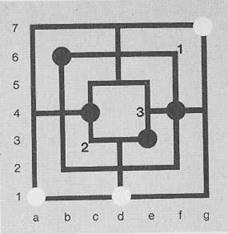 

 在这个位置上，不建议从黑方中拿走第四枚棋子，因为双磨机可以通过占领点l;2或3而形成。

 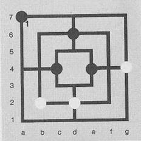 

 

|      |                                                              |
| ---- | ------------------------------------------------------------ |
|      | 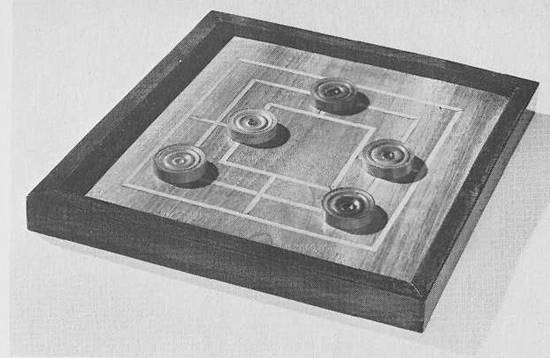 |

在这个位置，你可以删除第四枚棋子没有风险。 这只能是棋子。 盈利的方式是短暂的。游戏的这个阶段使用的战术在章节中设置（见第 48 页）。甚至更准确地收到。 

简单的          磨板      制成

德国，上半年19。世纪。一个未经装饰的计划， 镶嵌着白木和灰烬，  红木框架。 收藏巴伐利亚国家博物馆，慕尼黑。

 三连的建设

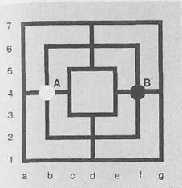 

 

第一个目标是占据中场一两个交叉点。 作为一个追随者（黑方），你总是占据场上第一相比，对手的棋子。在图片中，这是点 B。如果你错过了这个动作，对手占据这个platz和游戏，然后通常以平局结束。 对手，谁是第一个下注，当然是非常感兴趣的。

 

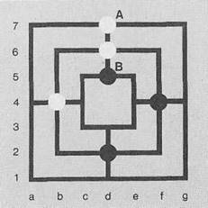 

 

建议立即建造垂直三连 （A）。黑方防止这当然与棋子B和s o体验更好

游戏。 

 

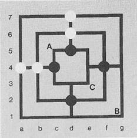 

 

如果白方如此粗心大意，想在两边建一个三连，这不会导致目标。

白方   必须是   一     个很好的

防止打开的柜台三连

设置字段 A.说到这一点，他就送走了一枚棋子。 黑可以通过证明 B 和 C 点来掌握主动权。 

 

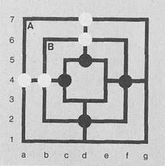 

 

如果白方继续这个意图，立即形成一个三连，他的命运很快被封存。尽管他又藏有两枚棋子，但他还是不能动弹。

 

以下游戏最好说明这一点： 

 

| 1. d6     | d2   |
| --------- | ---- |
| 2. b4     | f4   |
| 3. d7？   | d5   |
| 4.a4？    | c4   |
| 5.a7？    | a1   |
| 6. b6？   | b2   |
| 7. f6/xb2 | b2   |
| 8. g7/xb2 | b2   |
| 9. d3     | g4！ |

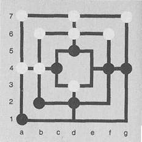 

 

\10. d3-e3   d2-d3 

\11. e3-e4   d3-e3 

\12. e4-e5   e3-e4xe5 

 

包括白方

 

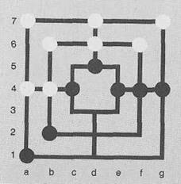 

 

同样无望的目标是在内部或外部正方形形成三连。 黑方可以占据A点，但白方也可以关闭两个三连。 

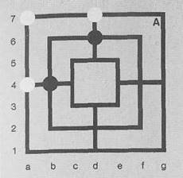 

 

如果黑方只允许敌人三连，那么它可以来到这个位置后，黑方的第 5 次移动：

 

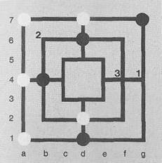 

 

正如你所看到的，白方只剩下一块移动的棋子了。如果他甚至赌第2 点，这几乎是必要的， 他有另一个不活跃的棋子。布莱克可以暂时占据积分l或3，用他的第二块最后一枚棋子，然后场上2，如果它仍然是自由的。白方站起来

损失。 

如果白方能组成所有两个三连，他的位置仍然是无望的。最终图像可能看起来像这样： 

 

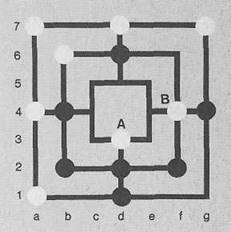 

 

白方承受着移动的压力，不得不用棋子拉A或B，这样他才能放弃。 

 

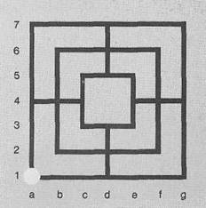 

 

​       \1. a1    

 

许多玩家认为，一个人现在必须占据相反的角落（g7）作为一个追随者，以便从而ver一个磨的吸引（白方）-  

阻碍。但更好的是：                         **变种****1****：**

​       

1 .d2 （或 b4） 9. b2 e4 2. g7？ b4      10.f4-f6 e4f4

​    \3. g1？   f4等。             

包括白方

 

 

游戏可能会像

**选项** **2****：** 

下面描述

 

很多，在 白方 3 三连

\9.   e4  b2/xe4 

建立 起来， 仍然 失去。 

\10. f4-e4      f2-f4 

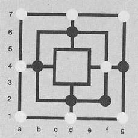

​                                   11.e4-e3   f4-f2/xe3

 

包括白方

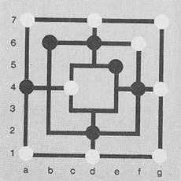

 

 

此位置在游戏后出现：

| 1.a1   2.g7   3. a7   4. a4/xb4   5. d7/xd6   6. g1   7. d1xd2   8. f4 | d2 b4 d6  b4 d6 94 d2 f2 | 同样在这个位置，白没有机会，尽管3工厂。 它唯一的自由石被封闭在几个动作。 |
| ------------------------------------------------------------ | ------------------------ | ------------------------------------------------------------ |
|                                                              |                          |                                                              |

 

 

 

 

 

 

 

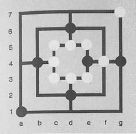                               这些    游戏  结束取消-        

退休了。在所有3个位置，一块黑棋子当然不能形成三连。 

 

小心中间正方形上的三连。一般来说，人们应该只允许建造一个三连，在极少数情况下，两个三连。 在以下两个

案件黑方输棋，因为他是在祖格旺和白方的他

​                                三连可以打开。

​       

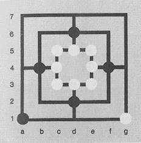          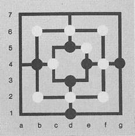 

​       

​       

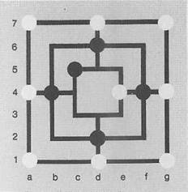         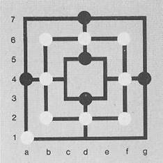 

​       

 

 

|      |                                                              |
| ---- | ------------------------------------------------------------ |
|      | 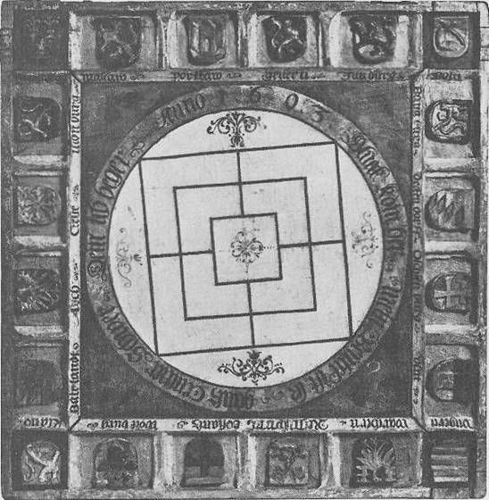 |

梅赫勒普兰·艾恩斯·布雷特斯皮尔斯·奥斯·塞德乌奇兰，嗯1500。盒子的操场是凹陷的填充物。 框架上有20件手臂

骨折的铭文： "不情愿， 沃彻恩，雨跟踪

科斯坦茨，    沃克堡，  克拉诺，

拜兰德，艾希，克莱厄，蒙特堡，马西利亚，马尔考，波特奥，吉恩，朱特堡，博恩"。给计划写："幸福出来"。我的包是勒。甘茨

 

中心 重。你的乞 帐。 

安诺1603"。收藏巴伐利亚国家博物馆，慕尼黑。

一个三连关闭！在哪里抢劫？

一般来说，你拿走一个重要的敌人的棋子，以便能够再次建立一个好的三连。如果对手不立即用新的棋子代替他偷来的棋子，那么一个人就会赢得

优势。 

 

如果你只剩下一枚棋子

放，可以把它与它

形成一个三连，所以你抢对手的棋子的地方，再次自己的三连可以关闭。

 

这种策略应该主要在第一个三连对一方自由使用时使用。 即使对手可以用他的最后一枚棋子组成一个三连，人们也应该按照描述的方式进行，因为白方也有，在一枚棋子从他身上被偷走之后，仍然有一个可移动的三连。

 

此位置提供了证据： 

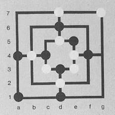 

 

\9.   a7/xe5      g1/xd5 

\10.  g7-g4       

 

黑方任意拉扯

 

\11.  g4-g7/xd3 

 

白方 仍然 与 开放 的三连， 

黑方输棋了！

 

有些棋手，一旦他们准备了三连，渴望关闭它，即使它只会伤害他们。你首先必须准备另一个三连，即使它仍然受到敌人的棋子阻碍。

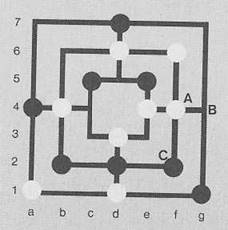 

 

​                                    在这个例子中，白方从A点到B点移动，布莱克必须打开他的三连，直到现在白方关闭开三连（b4-b6），抢夺黑石到f4，并有一个所谓的困境：一枚棋子来回拉，打开一个三连，同时关闭另一个三连。 

 

击中正确的棋子应该显示以下示例： 

 

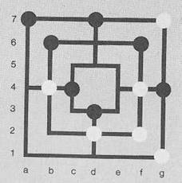 

 

白方在火车上当然必须与

 

​      \1. b4-b2    

 

形成三连。

 

现在白击中开放的黑方磨b6，d7或f6的棋子，所以白失去了

黑方列车 

 

​     第一 -      c4-b4 

 

白方 必须 播放

 

   \1. b4-b2/xg4！   

 

接下来是

 

\1.   -       d7-d6/xg1 

\2.   b2-b4   d6-d7 

\3.   b4-b2/xd3！ 

 

比 xb6 更好， 因为白方可以画d2 - d1， 白方已经击中了三个对立的棋子，他剩下的棋子非常集中。 黑方再也赢不了了，因为白方可以阻止所有特殊情况下的6枚棋子对5（4或3）对手的威胁。稍后将详细解释此策略（参见页面

58f） 

 

 

 

图第21页布雷特斯坦来自德国南部，约1600年。

波兰西格西蒙德一号（1467~1548年）。博克斯伍德， 0 5.6 厘米。巴伐利亚收藏

慕尼黑国家博物馆

曾特鲁梅勒的问题

较弱的棋手通常会试着很快到达三连。这种策略是不利的，因为它通常会导致失败。在某些变种或较弱的反作用下，可以在这里和那里实现平局（平局），很少也能赢。  

 

最常见的情况是，中心三连（在内部正方形）的形成是首选。   该示例旨在明确说明： 

 

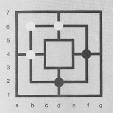 

 

这是初始位置： 

 

\1.  b4   f4 

\2.  d6 d2 3. b6？ 

 

这导致中间三连（在中间正方形），不建议。 

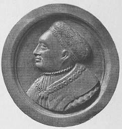 

 

因此，它如下：

 

\3.      -f6

\4.  b2/xf6      f6 

\5.  f2   

 

这枚棋子必须设置一次，火车本来可以从它保存。 

 

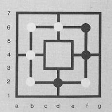 

 

这就是白方设置第 5 枚棋子后的位置， 黑方第 4 枚棋子：  

黑方现在将围绕对面的三连，并形成自己的三连与最后一枚棋子。 为此，需要以下列车。 

 

**选项** **1****：** 

 

| 5. -  | c4   |
| ----- | ---- |
| 6. e4 | d7！ |
| 7. d3 | a4！ |
| 8. a7 |      |

 

\8. e3白方也输了。

它将遵循：

 

\8.         -d5

\9.   e5    e3 

\10. d3-c3  e3-d3 

\11. e4-e3  a4-a1 

 

和黑方的胜利，因为他有一个免费的三连。 

 

**选项** **2****：** 

 

| 5. -      | c4    |
| --------- | ----- |
| 6. e4     | d7！  |
| 7. d1     | a4！  |
| 8. a7     | d5    |
| 9. c5     | g1    |
| 10. e4-e3 | d7-g7 |

 

布莱克又回到了三连

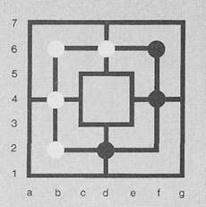 

 

在此处显示的位置中， 

白方刚关了一家三连，可以抢对手的棋子。 几乎所有玩家都倾向于拿走f6或f4上的棋子。 他们可以为对手设置一个陷阱， 作为一个安齐亨德， 并拿走 d2 上的棋子。 这将吸引布莱克形成一个三连（与 f2）， 潮流将转向有利于白方。 这是由于以下原因：白方是拉后设置的棋子，所以他可以第一个打开他的三连没有黑能够阻止它。 但是，白方必须始终威胁黑石领域与形成新的三连，把他的棋子放在e5，e3，g1，g7，a1等。  

| 以下一种方法： | 短游戏   | 有   |
| -------------- | -------- | ---- |
| 1. b4          | T4       |      |
| 2. D6          | d2       |      |
| 3. b6          | f2/xd6？ |      |
| 4. b2/xd2      | f6       |      |
| 5. e4          | d5       |      |
| 6. D7          | c4       |      |
| 7. c5          | d3！     |      |
| 8. e3！        | e5       |      |
| 9. d1！        | d2       |      |

 

黑方没有更好的移动

 

\10. b6-d6       d3-c3 

\11. e3-d3       f4-g4 

\12. e4-f4  

 

白方三连变得活跃起来。 如果在移动8，d1被播放，如下

 

\9.   e5/xd3  d3 

\10. b2-d2   f6-d6 

\11. d2-b2/xd3      d6-f6/xd7 

\12. b2-d2   

 

黑方没有更多。 你可以看到，胜利和失败往往是紧密在一起的。 

 

现在将显示一些具有  2个白方三连的变体： 

 

具有2个白方三连的变种

 

\1.  b4    f4 

\2.  d6    d2 

\3.  b6    f6 

\4.  b2/xf6       f6 

\5.  c5    

 

移动5.f2输了，从上一场比赛可以看出。

 

**选项** **1****：** 

 

​     第5名 -   f2/xc5？ 

 

这导致一个对称的位置，有利于吸引者。 与最佳发挥的白方，黑方充其量可以达到平局。

 

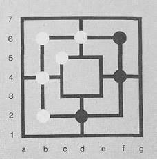 

 

**选项** **2****：** 

 

第5-c4！6.d5 e5！ 

 

最简单的获胜方式！在变体3中，它表明第6-，d7也导致胜利，但游戏是更复杂的。

 

\7. d7/xf6       f6 

\8. f2    

 

自由三连必须堵塞，否则布莱克将关闭它与他的最后一枚棋子，并轻松获胜。

 

\8.       -g7！

\9.  a1    

 

仍然是最好的火车！黑方威胁要打开一个三连与最后一枚棋子在g1或e3，此举将阻止它。

 

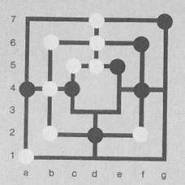 

|           |           |
| --------- | --------- |
| 10. a1-d1 | f4-e4     |
| 11. f2-f4 | c4-c3     |
| 12. b4-c4 | a4-b4     |
| 13. d7-a4 | g7-d7     |
| 14. a7-a4 | e3-d3     |
| 15. c4-c3 | d3-e3/xc3 |
| 16. a4-a1 | e3-d3     |
| 17. f4-g4 | d3-e3/xg4 |

 

黑方 获胜

 

 **选项 3：** 

 

| 1. b4 | f4   |
| ----- | ---- |
| 2. D6 | d2   |

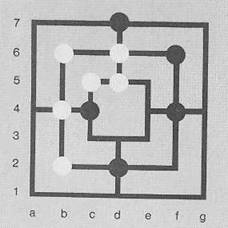 

 

\3. b6    f6 

\4. b2/xf6  f6 

\5. c5    c4 

\6. d5    d7 

 

见左下角的转弯！

 

\7. e5/xd7       d7 

\8. q2？g4！9.e4 a4！ 

 

也9。 -，一个7是可玩的，

但利润路径会更长

 

\10. e4-e3       f4-e4 

\11. f2-f4  g4-g1 

 

然后黑方绘制g1-d1-a1，因此在a-行上有一个坚不可摧的三连。 白是放弃的时机已经成熟。 

 

**变种** **3.1****：** 

 

1 至 7 号列车与第3 变型列车相对应。

 

​      \8. G4！   

 

这个   最初   不     明显的着法比第8f2要好得多。对布莱克来说，现在显然没有办法赢。

 

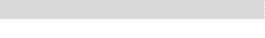**作为示例变体** **3.1.1****：**

 

\8.         -a4

\9.   d1    a1 

\10. e5-e4  d7-a7/xc5 

\11. d6-d7！      d2-f2/xd7 

 

不是11-，f6-d6，否则白方形成一个磨在g1，g4和g7。 

 

\12. b2-d2  

 

白方仍然击中至少2枚棋子，并持有平局没有任何问题。 

 

**变种** **3.1.2****：** 

 

\8.    -a1

\9. f2  

 

现在是最好的着法 9.g7之后？失去白方，因为第9-e4遵循第10 g4-g1????因为第10-，f4-g4！或10. b4-a4， d2-f2/xb2 和白方输棋.

 

\9.   -  g7/xf2 

 

非常好，任何其他的着法将导致失败！

 

\10. e5-e4    d2-f2/xc5

11 . b2-d2 a7-a4 

 

 

|      |                                                              |
| ---- | ------------------------------------------------------------ |
|      |  |

这游戏 结束画。

\5.       –d5 c3！

\6. c4    

 

（第6-a4？绑，如下所示变体显示： 

 

\7. a4/xc3       c3！ 

\8. f2     a1 

\9. g7    

 

仍然是最好的着法，因为不是所有的黑方威胁都覆盖。 

 

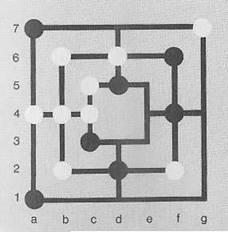 

|           |           |
| --------- | --------- |
| 9. -      | a7        |
| 10. d6-d7 | f6-d6     |
| 11.g7-g4  | a1-d1     |
| 12. g4-g1 | f4-e4     |
| 13. a4-a1 | a7-a4     |
| 14. f2-f4 | e4-e3     |
| 15. f4-g4 | e3-d3/xg4 |

 

黑人 获胜。 

 

 

 

 

\2. d6    d2 

\3. b6    f6 

\4. b2/xf6  f6 

\5. c5    d5 

\6. c4（而不是 c3！） a4？ 

\7. c3/xa4       a4 

\8. f2     g4 

\9. d1！  

 

不是 9.e4？ 因为 9日-，d3！ 

黑方 赢得 g4-g1和d1 

 

| **变种** **5.1****：**      |           |
| --------------------------- | --------- |
| 9. -                        | e4/xf2    |
| 10. c3-d3                   | d2-f2/xc5 |
| 11. b2-d2/xa4               | e4-e3     |
| 12. d2-b2/xg4               | f2-d2     |
| 13. b4-a4                   | d2-f2/xb2 |
| 14. d6-d7                   | d5-e5     |
| 15. b6-b4/xe3      只是平局 | f4-g4     |
| **变种** **5.2****：**      |           |

 

\9.       -d3

\10. d6-d7       f6-d6 

\11. d1-g1       d3-e3 

\12. g1-d1       

 

白方不能打开三连，否则3-e4/xc5跟随和黑方获胜。

 

\12.     -e3-d3

 

另一方面，布莱克不应该关闭，因为他不能把棋子从露天三连。

 

\13. d1-g1       d3-e3 

\14. g1-d1       e3-d3 

 

变种也只导致火车重复抽签。 

 

 

 

 

 

 

白方得到2三连，失去相当安全，  如下所示： 

 

| 1. b4     | f4   |
| --------- | ---- |
| 2. D6     | d2   |
| 3. e4     | c4   |
| 4. d3     | d5   |
| 5. b6     | b2   |
| 6. f6/xb2 | b2   |
| 7. e3     | e5！ |
| 8. c3/xf4 | f4   |

 

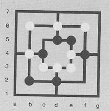 

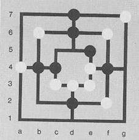 

 

| **选项** **1****：**                                         |             |
| ------------------------------------------------------------ | ----------- |
| 9.    c5？   10.   d6-d7                                     | a4！！d5-d6 |
| 11.d7-g7                                                     | f4-f2/xb4   |
| 12. b6-b4                                                    | f2-f4       |
| 13. g7-g4      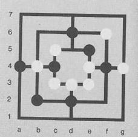     13.- | d6-d5！     |
| 14. g4-g7   f4-f2/xb4       白色 可以 放弃                   |             |
| **选项** **2****：**                                         |             |
|                                                              |             |

  **选项** **3****：**   

\13. g7-g4  c4-c5 

 

如果14。 c3-c4 14.。。 c5-d5/xc4 白方 15.任意，失去。

 

\14. a4-a1  b4-c4 

（或 任何） 

\15. b6-b4  c5-d5/xb4 

 

白方已经没有机会了

 

 

\9.   a4    a1 

\10. a4-a7  a1-a4 

| 9.    f2???   10. b4-a4   11.d6-d7   12. d7-g7 | a7！b2-b4 d5-d6 a7-d7 | 11.a7-d7   12. b2-b4   13. c3-c4   14. c4-c3/xd2   15. d3-d2 | f4-f2/xb4  c4-c5/xb4 b2-b4 c5-c4/xf6 c4-c5/xc3 |
| ---------------------------------------------- | --------------------- | ------------------------------------------------------------ | ---------------------------------------------- |
|                                                |                       |                                                              |                                                |

 

黑是更好的，但白方仍然有小的机会平局。

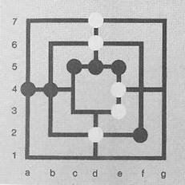 

 

白方采购2三连，一个中心和一个边缘三连，并没有

利润前景： 

 

| 1. b4     | f4   |
| --------- | ---- |
| 2. D6     | d2   |
| 3. e4     | c4   |
| 4. d3     | d5   |
| 5. b6     | b2   |
| 6. f6/xb2 | b2   |
| 7. e3     | c3？ |
| 8. e5/xf4 | f4   |

 

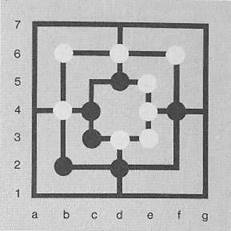 

 

**选项** **1****：** 

 

\9.   d1？    a4！ 

（更好的 g4） 

\10. d1-g1？  f4-f2/xb4 

 

黑人获胜。但是，如果白发挥更好的移动9-，g4那么黑很难赢。 

 

**选项** **2****：** 

 

| 9. G4          | a4        |
| -------------- | --------- |
| 10. d6-d7      | d5-c5/xb4 |
| 11.d7-d6/xb2   | c4-b4！   |
| 12. e5-d5      | c5-c4/xd5 |
| 13. d6-d5      | c4-c5     |
| 14.  d5-e5/xb4 | a4-b4     |
| 15. e5-d5      | b4-c4/xd5 |

 

如果白方打c5或12，黑方就赢不了。 

因此，黑方发挥更好的第7-，e3！ 作为第7-，c3？。目标应该是孤立敌人的三连！

对手多了一枚棋子，怎么打？

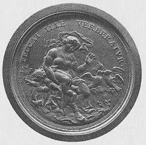 

 

如果对手还有至少 7 枚棋子， 比赛的大部分时间都输了。 在某些情况下，您仍然可以在外侧或内   方           绕圈移动。对手      不能   阻止   这一点              ，毕竟一个不是 

迫使 这

 

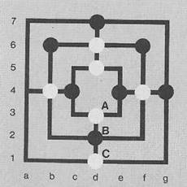 

 

放弃战术，为输球而比赛。

 

在此示例中，白方可以在内部正方形中来回拖动。 布莱克会小心不要从B移动到A，否则白方可以在火车上建造一个从C到B的三连。 

 

但是，如果其他棋手谁拥有一枚棋子比对手可以打开一个三连，那么他也应该打开它，并试图建立另一个三连。这样他就能赢得比赛。

 

 

 

在此示例中，游戏非常简单。 Schwarz打开他的三连 d6-d5， 然后从a1 - a4 中拉出，从而获得了另一个三连。 

 

仍然并不总是游戏是如此简单和清晰。 如果铣削不能按照描述的方式进行，则应在几次尝试后打开现有三连。  万一这个输棋的 n 去，  重建只是一个

时间问题。

 

这里有一个特例显示：2枚棋子少，但画！

 

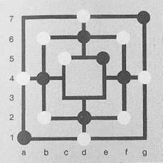 

 

在这个位置上有7对9的棋子，比赛还是平局。最常见的是，在有8对9棋子的比赛中，一个有8枚棋子的人一旦越强就能打开三连就输了。如果较弱的一方最初阻止对立的三连，这也适用。

 

 

 

 

 

 

 

 

 

 

 

 

 

 

 

 

 

 

 

 

 

 

 

 

 

 

 

 

 

 

 

 

 

图第 31 页：纽伦堡到 24 块木板之一

\1700. 维纳斯惩罚阿莫尔。背景是两只嘴鸽。 拉丁文铭文： PECCAT 叶尔·韦贝拉特夫

（那个失败了， 被打败了） 。

枫树， 0 5.7 厘米.收藏巴伐利亚国家博物馆，慕尼黑。

 

|      |                                                              |
| ---- | ------------------------------------------------------------ |
|      |  |

布雷特斯坦·奥斯·瓦罗扎恩，2岁。半个12世纪一个年轻人头上抱着一只野兔，两边都飞棋着狗。 在边缘上，它说："希克麻风病兽医收费（这里携带

猎人 野 兔）"。+5.6 厘米。 巴伐利亚 收藏

慕尼黑国家博物馆

对三连的恐惧

 

 

在此处显示的位置中，White将第 5 枚棋子设置为 e3，并及早推测（坏）三连。  这种意图导致一个缺乏经验的棋手采取错误的行动，因为他想阻止三连。 另一方面，一只摇篮狐狸并不为白人的行为所困扰。

 

他的反应是：

 

\5.  -d1

\6. e5/xd2  d2 

\7. d3     c3 

\8. c5（变为       d7） 

​     强制） 

\9. d6     g1 

 

黑人 获胜。 

 

在一些例子中，我们已经看到，敌人的三连是无法无限期地阻止的。 在这个例子的位置，黑方甚至必须与g7！白方迫使三连关闭。白方三连然后被包围，在这个坏三连的后面黑方可以建立一个免费的三连： 

 

 

 

\1.      -g7！

\2. g1/xd2      d2 

\3. d3-c3  g7-d7 

\4. c3-d3  

 

不可能有更好的火车

 

\4.      -g4-g7

\5. d3-c3       

 

白方会打开g1-g4吗？ 

黑方g4并 获胜

 

\5. -     a4-a7/xd6 

 

白方 输棋。 

 

现在，一个有益的游戏显示，其中白占据3个交叉和胜利，因为布莱克已经建立了一个三连在内部正方形。 

​      1.f4 2.d6    b4 f6？ 

 

黑方占据了周围的角落

防止对手在中心形成三连。 然而，这是多余的，因为白方正确地占领了三个十字路口立即。 

 

​     3.d2！      

 

 

 

\3.  -b2 b6/xd6？

\4. a1      

 

布莱克输了，因为他使这个看似好的三连。

 

| 5. D6 | d1   |
| ----- | ---- |
| 6. a7 | a4   |
| 7. c4 | d5   |
| 8. g7 | d7   |
| 9. e4 | g4   |

 

 

 

\10. e4-e5 d5-c5 

\11. e5-d5 d1-g1 

\12. a1-d1 a4-a1 

\13. a7-a4 

 

黑方 输了。 

 

在这场比赛中，白方继续说

 

\1. b4    f4

\2. d6    d2 

 

移动3在f2上。有了这个被动的棋子，他想阻止对手形成一个中间三连。 黑方答案最好与c4或a7。白方现在有麻烦了，因为施瓦茨现在已经主动了，也拥有了最后一枚棋子。尽管如此，白方还是有机会通过仔细的打法打成平局。

 

​       3.f2     c4 a7 

\4. e4      

 

 

 

**选项** **1****：** 

 

\5. d5？（更好的 g1） d7 

\6. g7      a1 

\7. a4      d1 8.d3       c3

\9.   b2？    

 

c5更有希望

 

\9. -  c5/xb2 

 

 

 

\10. d5-e5    f4-g4 

\11. d3-e3/xd2 c3-d3 

\12. e4-f4 d3-c3/xf4 13. f2-f4 g4-g1/xf4 

 

 

\5. g1       a1 6. a4       d3 7. d1       g1 8. d7       d5

\9. c5       e3 

 

 

|                                                              |                                                              |
| ------------------------------------------------------------ | ------------------------------------------------------------ |
| 10. g1-g4！   11. b4-b2！   12. c5-c4   13. d6-d5   14. d1-d2/xf4   15. b2-b4   16. b4-b2/xe4   17. g4-f4   18. f4-f6 | d3-c3 c4-b4  d5-c5 d2-d3/xc4 b4-c4-c4-xe4 e3-e4 c4-b4 c3-c3/xa4 |

 

画。 

 

图46：布雷特斯坦从奥格斯堡，约1520/25。描绘的是卢克雷蒂亚， 胸口有剑。林登木：眼睛、嘴唇和伤口是边界的，0 5.1 厘米。收藏巴伐利亚

慕尼黑国家博物馆

  白方输了。     **选项** **2****：**   

 

**变种** **2.1****：** 

 

\13. d6-d5 之后

 

 

 

\13. -  d2-d3/xd1 

 

而不是

 

| 13. -      | d2-d3xc4 |
| ---------- | -------- |
| 14.f2-d2！ | a1-d1    |
| 15. a4-a1  | a7-a4    |
| 16. d7-d6  | g7-d7    |
| 17. G4-g7  | d1-g1    |

 

白方有一枚棋子免费，画。游戏与第三 -， a7 也应该提出：

 

\1. b4 f4 

\2. d6 d2 

\3. f2     a7 

 

除了第三-，c4是最强的着法。

 

\4. e4 c4 

\5. d1 d5 

\6. g4 

 

\6. g7！ 

将棋子的活动a7

限制

 

| 6. -  | a1     |
| ----- | ------ |
| 7. a4 | g7     |
| 8. c5 | d7/xd6 |
| 9. D6 | e3     |

 

 

 

 

 

​      \10. b4-b2   

 

​         10.-c4-c3？？

11.c5-c4！     d2-d3 x 任何

 

不管黑石拍什么，他都会输！ 

 

​      11.-   d2-d3/xb2

 

**变种** **1.1****：** 

 

\12. d1-d2       d5-c5 

\13. d6-b6       

 

 

白 胜

**变种** **1.2****：** 

 

\11. -       d2-d3/xa4 

\12. d1-d2/xf4       

 

白方 赢了。 

 

**选项** **2****：** 

 

| 10.-           | d5-e5     |
| -------------- | --------- |
| 11. a4-b4      | a7-a4     |
| 12.  d6-b6/xd2 | d7-a7/xf2 |
| 13. b6-d6      | a7-d7     |
| 14.  d6-b6/xf4 | e5-d5！   |
| 15. d1-d2      | d7-d6     |

 

黑人以公开的困境获胜。 

不同职位的分析

 

 

白方有最后一枚棋子要放。 这场比赛似乎是平局，因为黑将移动从B到C，以防止对手打开三连，但有一个简单的解决方案赢得，白方赌注A，黑方移动从B到C和吸引有一个新的三连从A移动到B。 

 

 

 

 

1.f4-g4！ 胜利

 

在这里，两个三连似乎都被封锁了。 然而，通过打开垂直三连，水平三连变得自由。 

 

 

 

1 .f2-f4然后f4-f6

 

在这里，白方通过威胁F线上的新三连来解放他的三连。 

 

 

\1.  d2-d1，d3-d2 强制

\2.  c3-d3 并 获胜。 

 

在这里，白方打开他的三连，使他把3枚棋子带到一个新的三连。 

 

现在跟随对手可以立即再次形成三连的位置，虽然一个 s tin 只是从他身上拿走。 在前两个位置已经开放三连可用。 

 

 

 

 

在这个位置上，还没有三连。 

 

 

 

 

 

如果一个玩家在" 

建立一个交叉困境，如这里所示，那么他只能输掉比赛，如果他犯了粗暴的错误。 

 

 

 

一个三连可以通过威胁第二个三连暴露。 在本例中，祖格旺被利用。 

 

轮到白方了， 很快就输了， 他只剩下两枚棋子要拉了：  

 

| 1 . f4-f6   2. d2 - b2 3.  g1 - d1 4. a4 - a1   5. d7-a7   6. c5-c4 | f2-f4 d1-d2  g4-g1 a7-a4 d3-c3 d5-c5 |
| ------------------------------------------------------------ | ------------------------------------ |
|                                                              |                                      |

 

白方 可以 放弃

 

如果白方立即拉a4 - al，那么他输得更快。 

1 . a4-a1 a7-a4

\2. d7-a7       d3-c3 

\3. c5-c4       d5-c5 

 

 

 

在这个位置上，轮到白方赢了。但只有当他在移动1中玩f4-f2，从而打开第二个三连。 如果白方用b4-c4形成三连，那么布莱克可以打开他的三连与下一个移动e3-d3，并赢得对手的棋子之一。

 

​    1.f4-f2！      e4-f4

\2. b4-c4/xf4      b2-d2 

\3. g4-f4/xd2 e4-d3 4. f2-d2！ 

 

和黑方完成。 

 

 

 

在此处显示的位置中，每个玩家有 2 个交叉口和 4 个交叉口

设置在外正方形的棋子

 

白方中间正方形有3枚棋子，内正方形有2枚棋子。 有了黑方，情况就相反了。 白方有优势，因为它占据了连接到外正方形交叉口的连接点。 阳台上的黑石是封闭的，不影响游戏过程。 

 

布莱克轮到他了

立即失去位置。

 

\1.   -d5-e5

 

\2. c5-d5和白方三连关闭。 黑方不再具有节省的列车选项。 

 

即使有另一个动作，布莱克也会输：

\1.   -d6-f6

\2. d2-b2    d3-d2 

\3. b6-d6 和 白方 获胜。 

 

白方胜利后，一些复杂的动作是必要的：

 

\1. f4-f6   e4-f4

\2. e3-e4  d3-c3 

\3. d2-d3  b4-b2 

\4. b6-b4  c3-c4 

\5. d1-d2 

 

白方在c3-d3-e3线上形成三连。 

 

然而，像本例中一样，棋子分布在外四重奏中的位置并不总是能带来利润。 也就是说，一个谁在外正方形

连接线占据举行，在中间正方形只有2枚棋子和对手总是来齐母鸡在有利时机为他，然后比赛以平局结束。 

 

 

 

在这个位置上，白方赢了，如果他是1.c5-d5！或1.c4-b4播放。

 

如果白方用1.d6-d5形成三连，黑人至少能抓到1枚棋子。这将是一场平局。 因此：

 

| 1.c5-d5！   2. d5-c5/xd7   3. d6-d5/xd7   4. c4-b4 | a7 d7 g7-d7 d7 d2-b2 |
| -------------------------------------------------- | -------------------- |
|                                                    |                      |

 

黑方 输了。 

 

 

 

如果白方想赢得这场比赛，他当然必须形成三连：有4种可能性开放给他： 但只有一个赢了

 

1.f2-f4！ 

 

唯一的胜利游行是因为它再次打开一个三连。

\1. f2-f4/xd7      g7-d7 

\2. d2-f2/xa4      

布莱克已经没有机会了！ 

 

在这个位置上，轮到白方了，通过这个解决方案获胜： 

 

​    1.d1-d2/xd7！  b6-d1

​     \2. f2-f4       

 

 

 

**选项** **1****：** 

 

\2.       -d1-b6

\3. x 任何 

 

每一石黑命中后，白方有机会打开2三连，赢得比赛。

 

**选项** **2****：** 

 

\2.       –d6-f2

\3. g4-g7  f6-g4 

\4. d3-c3  

 

白方 赢了。 

在 以下 有趣的

情况赢得白方与 7

棋子，虽然黑方有3枚棋子可以立即带走一块！ 

 

 

 

​      1、d3-d2   

 

白方打开一转3三连！特例！它威胁

b4-b2/x或 d2-d3/x 或 d2-d1/x

 

\1. -       f4-f6/xd2 强制！

\2. f2-d2 

 

白方有2个三连在d1和d3上打开。黑不能飞棋进两个洞，输球。

 

即使轮到黑人担任这个职位，他也会输。

 

 

 

 

 

 

**选项** **1****：** 

 

​    第一 -          f4-f6 

x 任何

2.白方打开与d3d2绝对2磨和胜利。 

 

**选项** **2****：** 

 

​             1.-f4-d2

\2. c3-c4     d2-f6/xc4 

（d2-f6/xd3 3. f2-d2 和白方有 2 个开放三连） 

\3. d3-d2 

 

与 2 个开放 的三连 和 白方 的胜利。 

 

 

 

 

 

 

 

 

最后，             它将显示有多少棋子开放三连准备： 

 

有3枚棋子1开放磨是可能的。 

 

有4枚棋子1开放磨是可能的。 

 

 

有5枚棋子2开放的三连是可能的。 

 

 

 

 

 

 

 

有6枚棋子3开放的三连是可能的。 

 

 

 

有7枚棋子4开放的三连是可能的。 

 

有8枚棋子4开放的三连是可能的。 

 

 

 

有9枚棋子，6个开放的三连是可能的。 

纠纷

 

 

布雷特斯坦来自德国南部，大约1600年查尔斯五世（1500-1568年）。收藏巴伐利亚国家博物馆，慕尼黑。

 

规则说：任何棋子都不可能从封闭的三连里偷走。众所周知，没有规则是无一例外的，在很多地方，棋手认为，最后三枚棋子可能会被拿走，即使他们形成一个三连，人们必须同意在比赛开始前，并决定规则。 不，上面引用的规则似乎更合理。 

 

 

 

在此处显示的示例中，White 以 a1-a4-a7 关闭了一家三连。 黑方赢得三连与移动d7-d6/x。 在另一种情况下，黑方必须绘制d1-g1有2个开放的三连。白方只能飞棋进一个， 输了。 

 

​       原始但            罕见

位置显示如下：

 

 

 

火车     上的  黑方   有      

通过占用A 2场同时关闭三连的可能性。从逻辑的角度来看，布莱克当然有权同时击中两块对立的棋子。许多棋手对此表示怀疑。但人们应该考虑，这个双磨可能是通过其他火车来的。 如果每个三连的脚趾都形成，那么对手总共会失去2枚棋子。 

 

与许多纸牌和棋盘游戏，规则适用：什么谎言，那啄！ （感动，引导！片触摸[馅饼] 乔 ]）！在三连游戏中，这是没有处理得那么严格，因为它不是旅游者温和。 但人们或许应该指出，触摸的棋子也是拉的

在这一点上设置的棋子也将不得不保留。 在露天三连游戏中，棋子通常有长茎作为手柄。由于这里接触的可能性特别多，人们应该在战斗前说出这一点，并确定行为。   

 

 

|      |                                                              |
| ---- | ------------------------------------------------------------ |
|      |  |

 

棋盘游戏来自南德，约1560-1580年。游戏表面覆盖着丰富的鞋垫，外面主要是角与珍珠和黄铜的小母亲，里面主要是珍珠的母亲。画是用黑方雕刻的。 收藏巴伐利亚国家博物馆，慕尼黑。

在 中奖位置的情况下： 包围 还是 抢劫？ 

每个人都可以自由地包围对手的棋子来结束比赛。

但是，如果你仍然至少有

有7 枚棋子         和    1块

预备三连，为了不被对手的三连措手不及，那么抢敌人的棋子就更优雅了！

 

没人喜欢被圈起来。 许多人仍然相信救恩，如果他们仍然有3枚棋子，可以飞棋，但这不是一个错觉在这个位置。 

 

其中一位作者曾经在露天游戏区与较弱的对手比赛。用9枚棋子，他可以抢除4个以外的所有对立的棋子，然后圈这4个，但他自己有所有的棋子带走，除了3，虽然许多

观众们惊恐地摇了摇头。如果对手没有击败第四枚棋子，比赛就会以平局告终。但不可避免的是，对手的"贪婪"被击中，因为强者用他的3枚棋子赢得了观众的快乐和对手的失望。 

如果您还有9、8或7

棋子和对手只有5

 

 

 

或者4，那么你必须考虑你是否还想打对手的第四枚棋子，或者你是否圈了所有4枚棋子。 如果对手不将 3 枚棋子合并到三连中，则至少 7 对 4 枚棋子的包围总是成功的。 然而，人们常常也被迫抢夺对手的第四枚棋子，以防止棋子被从你手中夺走，因为一个以6枚棋子对4枚棋子结束比赛的结局已经无法获胜。  

 

 

示例显示了7 对4 棋子站立的位置，胜利在被开三连抢到第 4 枚棋子后成功。

 

| 1.          d6-d7   2.          a4-f2   3.          g4-d1 4. d7-e4 5. e4-d6   6. d6-g4 | a1-d1/xa7  d1-g1 d5-e5 c5-c4 e5-e4 c4-c3 |
| ------------------------------------------------------------ | ---------------------------------------- |
|                                                              |                                          |

 

三连现在开放，但

黑方也将乘火车

 

\6.  -，c4-c5 赢，因为 白 在

 

\7.  火车是的，必须飞棋出一个对面的三连。 

 

倒四枚棋子只有在你自己还有一个开放的三连储备的情况下才能被打败。除此之外，对手不得占据两条碰撞线，每条有2枚棋子（黑石的位置在内方，比较。 图像）。如果在这种情况下击败对手的第四枚棋子，他仍然可以： 通过飞棋n赢。 这显示在以下游戏中： 

 

 

 

\1. g4-g7/xd3 e3-c3/xd1 

\2. d7-d6   c3-d7 

\3. f2-f4    d7-c3/xd6 

 

白方 输棋。 

飞棋

如果两个同样实力相当的选手互相竞争，并且有6：6、6：5、5：5、5：4、4：4可能也以6：4的比分对阵，那么如果对手不能再被圈起来，那么平局就不会再打。 因为经验表明，一个谁可以飞棋第一胜9的10个案件。 所以，你不应该，如果你仍然有6，5或4棋子，让对手飞棋，除非你在

时刻一个极其有利的位置。卡皮电话结束游戏中描述了这些位置。

 

能先飞棋的人必须尽量把对手的棋子打到 4 块。然后，他不得不把剩下的棋子分开。 许多玩家通过过早的铣削使自己处于弱势地位。你的三连可以在开始和中间游戏被包围和封锁，对手在最后一场比赛中以3枚棋子对4，5或6飞棋赢。 

 

以7：4或7：3的比分，比赛很快结束。 一旦你可以迅速阻止4个对手与7枚棋子，但利润可以带来更安全，当第四枚棋子被带走。 

以下3 个位置说明     了这一点。    白方   有一块免费的棋子，黑方必须释放三连。 

 

经过一些练习，你应该毫不费力地           找到这样的获胜路径。

 

 

 

 

 

 

 

 

 

 

 

在这个位置是7：4棋子。 在拿走第4枚棋子之前，你必须拿走2枚棋子。

建造一个三连。否则，对手很容易先建立三连，赢得胜利。 

 

例如，一个收益为：

 

| 1.          e5-e4   2.          b4-b2/xf4   3.          d2-d3 4. d6-d5 5. a7-d7 6. d5-e5   7. d7-d6 | a1-d1 c5-f4  d1-d2 d7-e5 e5-d6 d6-e3 |
| ------------------------------------------------------------ | ------------------------------------ |
|                                                              |                                      |

 

和黑方必须让位从三连。 

 

与8或9棋子对3枚棋子，游戏放松甚至更快。 

 

在大多数情况下，以3对4的棋子和后来的3对3的棋子进入胜利的位置并不难。你必须在打4之前。对立的棋子驱动棋子分开。 这有时只在困难或奥伯奥普特没有成功。 

 

轻松取得胜利的示例：

 

 

 

\1. b2-d7       d5-b2 

\2. f2-d1 

 

人们寻找一个没有对立的棋子阻碍的方式。 

 

\2.    –b2-d3

\3. d2-a1     d3-g1 

\4. d1-a7 

 

是时候了

 

在此        示例中，       赢

黑方的诡计： 

 

 

|                                                              |                                                  |
| ------------------------------------------------------------ | ------------------------------------------------ |
| 1. -   2. e4-f4   3. d2-g7   4. g7-a1！   5. a1-d3！   6. d6-g1   7. g1-a7   8. f4-c4 | f4-g4！f2-g1 g4-d1 g1-d2 f6-a1 d1-a4 a1-b4 a4-b2 |

 

黑人 获胜。 

 

在这个例子中，轮到白方赢了：

 

 

 

\1. a4-d7 或 a1-g7 

 

再简单不过了

 

另一个例子，其中3棋子战胜4： 

 

 

 

1.f2-d7/xd2！d3-f6 

 

黑方必须威胁，否则2.d7-g1如下！

 

\2. g7-f2       b4-g7 

\3. d7-a1      f6-a4 

\4. a7-d2      f4-b2 

\5. f2-d1 

 

现在两个三连是开放的，白赢了。 

 

在这个位置上，黑是允许形成三连，一条通往胜利的捷径！  

 

 

 

\1. d2-f2/xa7！b4-d6 

\2. f6-b6  d1-f6 

\3. f4-b2 

 

胜利。 

 

或 这个 地段： 

 

| 1.    d2-f2-/xa7！   2.    f2-c4   3.    f4-b6   4.    f6-c3   5.    c4-d6   6.    b6-d3   7.    c3-d1   8.    d3-g1   9.    d1-g7   10. g1-d7 | d1-a4 a4-f2  f2-d6 d6-c5 e4-f6！c5-e3！ f6-d2 e3-a1 b4-g4 |
| ------------------------------------------------------------ | --------------------------------------------------------- |
|                                                              |                                                           |

 

那更复杂白方防守很好。

 

 

 

如果同一个方块上有4块颜色的棋子，那么游戏以平局结束。  如果一个正方形有4枚棋子，对手有时可以设法推开其中一枚棋子。这有助于赢得胜利。  

 

还有决赛，有3对3棋子。一个棋手有威胁，但另一个总是可以抵挡。这些游戏导致平局。

 

 

 

白方相信以1.e4-e5/xb6赢得这个位置。然而，用一个技巧，黑保持平局。 白方仍然应该等待三连的关闭。 

 

\1. e4-e5/xb6 d2-f6！ 

 

 

 

\2. e5-b6 强制

\2.            -f6-e5！

 

 

 

\3. d5-b4       e5-b2 

 

 

 

\4. b6-d5       b2-e5 

 

白方不能解放自己

通过火车重复绘制。 ' 

​       

露天三连操场                   （照片   G.  奥斯特塔格/鲁特林格

越来越多的频率在公共一般记分牌）的地方创建。 

决赛

3 枚棋子 对 4 枚棋子： 

 

3枚棋子对4枚棋子的结局几乎总是为那些有3枚棋子的人赢得。

但是 ，玩家必须 与 3 

石恩   遵循   以下原则：

 

\1.   在拿下对手的第四枚棋子之前，你必须估计他是否不能一次性用剩下的3枚棋子建造两座三连。 

 

\2.   小心敌人的棋子足够分散，以避免平局的危险，这有时是不可避免的。

示例）。 

 

\3.   此外，必须飞棋）总是威胁2枚棋子一个开放的三连，直到你拉到第三和2米可以放置ühlen。 

 

\4.   注意力！你绝不能以对手可以与反威胁相提并论的方式威胁。

 

 

 

在这里，白方必须在d6或b4上进行威胁。例如，如果白方威胁f6（第1g7-f6？？）黑方播放第1-，g1-d6和白方必须parry d5. 现在布莱克可以进行比赛并获胜了。 

 

通常情况下，你永远不能失去3枚棋子对4或5斯特因的对手。 但是，如果你没有掌握这个阶段在终局完全，你应该简单地依靠4的命中。或5.为了实现安全平局，放弃对手的棋子。

 

 

 

下面显示了一个特殊案例。 黑方必须采取g7或g4和白方移动g4-f2后的优势。因为就像黑帕里三连一样，白方可以用反磨机操作。黑在这样的位置不应该形成三连！ 

 

 

 

在这个位置上，黑石可以打败任何白石，白石可以任意开2个三连。 

 

如果，而不是形成三连，布莱克已经阻止了f6，他将有一个优势后1.g4-g7，f6-al/xg7，因为白方没有2。磨比尔恩可以和从黑三连可能不会采取棋子。 

 

 

 

在这个位置白方必须有1.e4-d2！抽签，因为如果他关闭与e4-e5三连，他会输。他可以抢对手的b2，d3或f2，但布莱克仍然会有eine开放三连。与g1-g4黑方将打开另一个和白方只能阻止一个。 

 

\1. e4-d2！       g1-g4 

\2. d2-e5/xd1 

 

黑米输了，三连的关闭对他不再有任何用处，因为白磨一定不能碰。最后3枚棋子对5枚棋子是通过打一个

对立的棋子减少到游戏结束3棋子对4枚棋子。如果我这个分数，玩家可以赢得3棋子在9出10的情况下。 下面是一个例子。白方有3枚棋子，黑方有4枚棋子不能带走第4枚棋子，虽然这一个有一个开放的三连。 

 

 

 

1 . b4-b2/xc4

 

黑方不能再计数器了。 

5 棋子 对 4 枚棋子： 

 

 

 

在示例中，1. f2-d2 会吗？一个严重的错误！白方可以封闭三连。 用1.d6-d5！白方会打成平局，因为黑方的4。白石不打达夫，白石会赢，所以用3枚棋子对5枚棋子。

 

1  .f2-d2       e5-d5！ 

 

黑方的好动作。对面的三连被包围了。 它会被误认为黑方与e5-e4反过来想关闭一个三连。 

 

2  d2-d1       g4-g1 

 

布莱克在搬进来时会赢。

 

3  d1-d2       g1-d1！ 

4  d2-d3       d1-d2 

 

白方无论走到哪里，他都被困住了。

 

 

 

如果轮到黑人而不是白人， 比赛将以平局结束。 然后白方将反对， 不能再包括作为后续行动。  

 

5  d3-e3       d2-d3 6. e3-e4  d3-e3

​      \7. e4-e5   e3-e4

 

包括白方。 

 

你可以看到，锁定时，它不仅取决于位置，而且还取决于谁在移动（反对）。 

 

6 棋子 对 4 枚棋子： 

 

 

 

示例表明，只有当4 块对立的棋子只分布在2 个相邻的正方形上时，才可能通过包含来取得胜利。 

 

​      1.f6-d6    d7-g7

\2. d1-a1      d2-d1 3.d6-d7  d5-d6 4. d7-a7  g7-d7 5. g4-g7  g1-g4 6. a7-a4     d7-a7

​      \7. g7-d7   g4-g7

 

白方被包围。 

​     在     以下         两个

例如，通过建造 3 个开放式三连来取得胜利。

 

 

 

1  e3-d3       d1-d2/xg7 

 

白方不能飞棋进两个三连。 

 

 

 

\1. e5-e4    d7-a7！ 

\2. g7-d7    b4-b6/xd7！ 

 

在第三个移动黑方然后拉b6b4，并有2个开放的三连。 

 

 

 

这里是一个胜利描绘，

白方实现与加强困境（与一列火车 2 三连打开） 。

 

\1. b6-b4/xd3     c3-b6 强制！

\2. a4-a7 

 

2 开 厂！ 

 

6 枚棋子 对 5 枚棋子： 

 

 

 

在正确的对手的棋子被盗后锁定，可以取得胜利。 

 

1.c5-d5！ 

 

如果白方不阻止黑人的三连，游戏以平局结束，如果黑方平局d6d5。 

 

\1.       -d6-d7

\2. d5-d6！       d2-d3 

\3. e3-e4/xd3     d7-g7 

\4. e4-e3  g7-d7 

\5. g4-g7 

 

黑方 是 封闭的 3 枚棋子 对 9 枚棋子： 

 

 

 

3飞棋石往往非常强。   你可以       战胜   9个对手的棋子或至少打成平局。 

 

在此处显示的位置中，3块黑石占了上风。 对手在抢黑第四枚棋子之前应该仔细考虑一下。

 

\1. f2-f4    d6-g1/xf4 

\2. d5-d6   g1-d5 

\3. g7-g4   d5-g1/xd6 

\4. e5-e4 

 

关闭白方三连是没有用的，因为黑磨机不能被触摸。 

 

| 4. -   5. e4-f4   6. a7-a4   7. c5-c4   8. d2-b2   9. d7-d6 | a1-g7  g7-a1/xg4 g1-f2 f2-g1/xb2 g1-b4 b4-g1/xb2 |
| ----------------------------------------------------------- | ------------------------------------------------ |
|                                                             |                                                  |

 

 

 

在这个位置上，只有白方犯了一个错误，黑方才能赢。随着移动d6-b6白已经形成了一组三，第四枚棋子可以自由移动。

                    开篇 本 章介绍 各种开篇     。 他们没有具体的名字。但是，由于比赛不仅在地方                  一级举行，而且 在国际上举行只是时间问题，直到有更多的关于三连游戏的文献，开放肯定会很快带有众所周知的名字，如国际象棋。       

 

在伯尔尼与作者一起踢球的苏黎世棋手解释说，他们的战术完全不同。土耳其人在伯尔尼也保持了惊人的好

西班牙人、南斯拉夫人和意大利人非常精通名字，这就是名字已经存在的地方

荷兰进攻，苏黎世战术，日内瓦变种，穆勒的游戏，卡德纳乔系统，

土耳其防御等

 

这里呈现和注释的开口仅代表各种可玩性中的一个选择

变种. 

 

            

​      

​          绘制变种                       黑方更好

           

​       

白方    是    侵略性的，                   有利于黑方

游戏结果 已 打开

 

 

白方代表利润

 

 

 

 

 

 

 

 

 

 

 

 

 

 

 

不推荐

 

 

白的无用尝试

 

 

 

 

 

 

 

 

 

 

 

 

 

 

 

 

白方代表利润

           

​      

​        卡德纳乔系统                    黑方 支架 更好

​       

​       

​       

​       

​       

​       

​       

​       

​       

​       

​       

​       

           

​      

​       白方有轻微的优势                  黑方代表利润

           

​      

​          绘制变种                       黑方更好

​       

​       

​       

​       

​       

​       

​       

​       

​       

​       

​       

​       

           

​      

​        黑方代表利润                    黑方支架更好

​       

 

 

黑方代表利润

 

 

 

 

 

 

 

 

 

 

 

 

 

 

白是亏了

 

 

白是亏了

 

 

 

 

 

 

 

 

 

 

 

 

 

 

土耳其双磨攻击在事后。黑方代表利润。 

不同的 游戏

 

 

这里介绍的游戏旨在刺激对游戏过程的精确分析。 

 

此示例显示了第二个玩家的过早交叉三连攻击： 

 

 

 

\1. d2 d6 2. f4 b4 

3.d5  d3 4.a7       c4？

 

 

 

 

布莱克的攻击来得太快了他应该把第四，e4放在第一位。 他想教白方一个位置劣势与孤立的对a7，a4，但在现实中，他放弃了一个重要的节奏。

 

 

 

\5. a4  a1 

\6. g7！ 

 

现在黑必须尝试停止白方的攻击与d7或g4。 以下两个变种表明，不再有任何救恩的黑方。 

 

**选项** **1****：** 

 

\6.     -d7

\7. g4！       e4 

\8. g1/xe4      e4 

\9. b2！ 

 

 

 

白方有一个开放和免费的三连，其中黑也发挥，他已经失去了（最好仍然是f6）！

 

\9.         -f6

\10. f4-f2/xf6 c4-c3 

\11. g1-d1   e4-e3/xd1 

\12. f2-f4   d6-f6 

\13. d5-d6 

 

黑方再也打不下棋子了。 

 

**选项** **2****：** 

 

\6.     -g4

\7. f2！       f6 

\8. b2/xf6      f6

\9. d7/xd6 d6 

 

 

布莱克       很快就会     面临搬家的压力。

 

黑方不能画a1，因为白方与a4-al！会反击。在c4-c3上，白方会与c5-c4做出反应。

 

| 11.d2-d3   12. a4-b4   13. f2-d2   14. d3-c3   15. d2-d3 | b4-b6/xb2  a1-a4 e3-e4 e4-e3 |
| -------------------------------------------------------- | ---------------------------- |
|                                                          |                              |

 

黑方 承受着 压力。 

 

 

 

这个游戏显示了

"纳楚格斯"。图为黑方与 9 之后的位置。 棋子关闭了          三连，抢劫了d5。 

 

​        1.d2     d6

\2. b4  f4 

\3. d5  d3 

\4. g7  c4 

\5. g1？ 

 

| 过早      的威胁，      损失很多线索。     5.       -g4  6. e4 | 自   | 1.d2   2. f4   3. d5   4. c4 | d6 b4 d3 e4 |
| ------------------------------------------------------------ | ---- | ---------------------------- | ----------- |
|                                                              |      |                              |             |

​                                       \5. b6 

白方必须帕里，只有               

3枚棋子，不能再一旦这个位置达到，威胁。 因此，黑方可以找到2即使与最佳发挥

| 磨坊制造。     6.    -f6  7. f2  b6/xf2   8. f2  c3   9. e3 | 两个对手都没有办法获胜。 此外，如果双方都想避免失败，就必须努力克服一些陷阱。 |
| ----------------------------------------------------------- | ------------------------------------------------------------ |
|                                                             |                                                              |

 

即使白方播放b2/xc3，黑方也以e3获胜！它威胁c4-c3/xe4的困境。 

 

​      第 9 名 -  c5/xd5

 

白方仍然可以用他的开磨机砸棋子，但随后没有机会对抗两个自由三连的黑方。

 

以下示例显示抽签变体： 

 

**选项** **1****：** 

 

​              5.-g1

​        \6. a7    

 

最好的举措！但a1或g7也将是平局。 

 

| 6.-   | g7   |
| ----- | ---- |
| 7. G4 | a1   |
| 8. d1 | e3   |
| 9. b2 |      |

 

或f6。所有其他动作都会失去 z .B。9. e5. c3/xc4

 

\9.   -  e5/xb2 

 

如果布莱克打 e5 / xd5， 他输了 10 后。 a7-d7！ e5-d5。

 

\10. a7-a4 g7-d7 

 

由于在外正方形上绕圈而开奖。

 

会玩这样的黑方：

 

​           10.-d3-c3？

 

所以他失去了后

 

​      11.d2-d3   d6-f6

\12. f4-f2       e4-f4 

 

仍然是最好的火车。

 

\13. f2-d2/xb4！f4-e4/xd5 

 

在xb6？白方会用火车g4-f4包围三连。

 

\14. d2-b2！    

 

白方      以               

困境。 

 

**选项** **2****：** 

 

 

 

\5.     -a1

\6. a1   

 

移动 g7将同样好， 因为位置是对称的。 g1 将输棋：6. g1， g7 7. d7， a1 8. a4， e3！当白方播放时，黑方形成三连，并释放自己 e.B. 9. f6， c3 / xd2 l 或 9. e5， c3 / xc4 

 

| 6.-     | g7   |
| ------- | ---- |
| 7. D7   | g1   |
| 8. G4   | e3   |
| 9. b2！ |      |

 

如果黑方对 c3/xd2  做出反应， f6将输棋移动。

 

​      第 9 名 -  c3/xd2

f2也会导致平局。 

 

**选项** **3****：** 

 

 

 

\5.   b6  g1 

\6.   a7  g7 

\7.   g4  

 

类似于变种1，但现在

 

​            7.-e3

\8.   e5  c3/xe5 

\9.   e5  a4 

 

移动c5也将是平局。

 

\10. a7-d7     g1-d1 

 

它威胁着三连

 

| 11 . f4-f6     | e4-f4     |
| -------------- | --------- |
| 12.  c4-c5/xd6 | c3-c4/xf6 |
| 13.  b6-d6/xd3 | b4-b6     |
| 14. e5-e4      | b6-b4/xc5 |
| 15. d6-b6      | d1-a1     |
| 16.  b6-d6/xf4 | a4-a7     |
| 17. d2-f2      | b4-a4/xf2 |
| 18. d6-b6      |           |

 

 

布莱克已经击败了4 枚棋子， 白方在第 19 枚棋子上抢了第4 枚棋子。

火车。积分除以。 

 

 1730   年左右，     维也纳弗朗茨· 安东·赫尔曼的 棋     盘游戏。

丰富的带状带状物，框架上和丝带之间有贝壳。中间是土耳其统治者。枫叶，红木，核桃。收藏

巴伐利亚      国家博物馆，慕尼黑。 

最重要的基本规则

游戏应该以保持移动性的方式构建。相反，三连应该是活泼的，如果这可以被对手包围，然后不能再打开。 

 

另一方面，一个在2面甚至3面之后开张的三连可以毫无顾虑地形成。 对手将不得不使用2到3枚棋子来磨这个三连。 

 

占领三个十字路口是理想的，占据4。另一方面，带来没有利润。 

 

比赛开始时，应该防止对手的横磨。你不应该想自己建造一个，因为奇怪的是， 如果对手成功地挡住了它，这个三连会导致损失。 然而，在比赛接近尾声时，一个跨三连可以带来成功。 

 

另一方面，不能妨碍自己棋子的拉力可能性，反对三连和

分组被阻止。

 

不要建造边缘三连，因为这些可以很容易地被封锁。

 

​       梅赫斯皮尔    是   一个

组合游戏。尽管看似简单的火车选择，人们应该寻找更好的火车。

 

在露天运动场上，您应该始终采取相同的位置来跟踪大空间。 

谁占优势？  

黑方 还是 白方？ 

 

 

 几乎总是你听到，特别是从缺乏经验的棋手，任何游戏可以很容易地保持平局或白方会赢，因为他先下注。  事情不是那么简单，                      因为任何人谁读过这本书的ufmerksam，现在会知道。 

 

​        在国际象棋      中证明

白人                作为的统计数据

吸引有优势，赢得     更多的 比赛。  这种比较是从三连游戏缺少的。 

 

根据我们的经验，机会相当逆转。 黑方可以设置最后一枚棋子，因此有作为最后一个形成三连的优势。 

 

那同样强壮呢

玩家来自？黑方还是白方是优势？ 在这里，经验也告诉我们，黑人有优势。  白方有第一个动作，总是一枚棋子领先时设置，但对于黑方是更大的优势，能够设置最后一枚棋子。 sy-1指标位置除外。 有白方达到与第一

训练o英尺一个有利可图的位置。至少白人可以持有在这种情况下抽签。 因此，黑方必须防止出现对称位置。 

 

三 个例子

 

旨在证明这一点： 

 

 

 

​     1.d6-d7     d5-d6 

\2. e5-d5 

 

白方赢了因此，建议对手不要不断对称下注。 

 

 

​       1.g7-g4   

 

如果布莱克不打开他的三连， 白方抢劫c5 后，他已经关闭了三连 2. g4 - g7 。 

 

在最后一个例子中，对称性使白方具有优势： 

 

 

 

| 1.          d2   2.          f4 3.a7    过早！   4. d7 5. e4   6. g1 | d6 b4 d5？      g7 g4 c4？ |
| ------------------------------------------------------------ | -------------------------- |
|                                                              |                            |

 

不太好，因为对称位置。 

 

\7. a4  a1 

\8. d3  d1 

\9. b2  f6 

 

移动 f2 在10. d3 - c3、 d5 - e5 11. e4 - e3、 c4 - c5 12. d2d3 / xe5  之后立即输棋。

 

| 10.  f4-f2/xf6 | Q4-f4     |
| -------------- | --------- |
| 11 . d3-c3     | b4-b6     |
| 12. g1-g4      | f4-f6/xe4 |
| 13. f2-f4      | d5-e5     |
| 14.  f4-f2/xg7 | c4-c5     |
| 15.  g4-g7/xc5 | b6-b4     |
| 16. f2-f4      | b4-b6/xf4 |

 

白石还有7枚棋子，保证利润。

 

\17. b2-b4  d1-g1 

\18. g7-g4 

 

黑方完成。 

规则 和 

锦标赛指南

白方         的         玩家

棋子开始游戏。

 

可以或应该注意单个动作。 为此目的，特殊形式，因为他们也用于国际象棋，是可用的。 误解可以更好地避免。  

 

对于比赛的主办，赛事总监手头有所谓的配对表。每个参与者都得到一个

编号。第一个数字是白方的。如果比赛是双跑，颜色会发生变化。

 

对于大量的

参与者       无法        发布

玩表。在1。轮转批分配合作伙伴，在随后的回合中，每个玩家被分配一个得分相同的合作伙伴。 上和纳奇祖格应该保持大致的平衡。 这样游戏就不会持续太久，你玩双时钟，因为它们也用于国际象棋。在一个案例中，有两个时钟相互接触。 如果玩家执行了他的动作，他按下杠杆或按钮，对手的时钟启动。

 

此外，表盘上还附有可见的运行标志。

 

规定一定时间的动作，使游戏不会持续太久。 否则，一个境况更差的棋手很容易被诱惑放慢节奏。已经播放的时间总是可读的双时钟。 由于比赛一般不会持续太久，30个动作的时间可以设定在30分钟。 

W在这                  很多

时间跨度还没有结束，所以可以由锦标赛的领导人估计，如果没有关于平局状态的协议来。如果时间允许，"逾期游戏"以后可以在相同的条件下重播，以确认到目前为止消耗的时间。 游戏中的位置和时间是要注意的。 

 

时钟手将两侧设置为 11：30，以便时间已完全过期在 12：00 点。 如果一个玩家需要的时间比规定的时间多，那么一张传单落在第12段，游戏是由于

超时 输棋。 

 

任何碰棋子的人也必须把它拉下来，当它被引爆时，火车被认为是被处决的。

 

赢得的一场比赛可以评为 l 点，平局为 1/2 分。

 

总冠军是谁得分最多。 

 

其中一些规定可根据情况和情况加以修订：

 有了棋钟也可以举行三连比赛。 

​       

​       

​       

​       

​       

​       

​       

​       

​       

​       

​       

​       

​       

​       

​       

​       

​       

​       

​       

​       

**交配表** **/** **表 贴述**

**3****和****4****棋手**                  **5****和****6****棋手** 

​       

第一轮：      1-4    2-3    1.回合：      1-6    2-5    3-4 2.回合：    4-3    1-2       2.回合：      6-4    5-3    1-2

\3. 回合：      2-4    3-1    3.回合：      2-6    3-1    4-5

\4. 回合：      6-5    1-4    2-3

\5. 回合：      3-6    4-2    5-1

 

 

  **和****8****名棋手**                    **9****和****10****名棋手** 

第一轮： 1-8 2-7 3-6 4-5       1.     回合： 1-10 2-9 3-8 4-7 5-6 2.回合： 8-5 6-4 7-3 1-2       2.     回合： 10-6 7-5 8-4 9-3 1-2 3.回合： 2-8 3-1 4-7 5-6    3.     回合： 2-10 3-1 4-9 5-8 6-7 4.回合： 8-6 7-5 1-4 2-3  4.     回合： 10-7 8-6 9-5 1-4 2-3 5.回合： 3-8 4-2 5-1 6-7  5.     回合： 3-10 4-2 5-1 6-9 7-8 6.回合： 8-7 1-6 2-5 3-4    6.     回合： 10-8 9-7 1-6 2-5 3-4 7.回合： 4-8 5-3 6-2 7-1  7.     回合： 4-10 5-3 6-2 7-1 8-9

\8.    回合： 10-9 1-8 2-7 3-6 4-5

\9.    回合： 5-10 6-4 7-3 8-2 9-1

​      

 

 

 

 

 

 

 

 

 

 

 

 

 

 

 

与国际象棋一样，游戏记录在表格（符号上），如下两页所示。

**游戏****#****：** **播放**：**20...**

........................................................................................................................

**白方黑方：** ........................ 

**备注**：

........................................................................................................................

........................................................................................................................

拉德梅勒

 

 

车轮或圆磨机是三连的一种非常古老的游戏形式，可能是最古老的品种之一。然而，d他缺乏证据，这是原始形式的

梅勒斯皮尔可以采取行动。雕刻在石制运动场上的最古老的发现可追溯到罗马军团在高卢和德国的时候。 然而，由于有很多旧的文件可用于今天的日常三连游戏，只有同样简单的游戏版本

拉德梅勒代表这个时代说话。

 

在拉德梅勒，每个棋手只有3枚棋子，他与对手交替在

游戏计划 集。这个计划 是 一个

车轮有8个辐，结果是9个游戏点：圆的中心和8点的圆和辐的交叉点。你可以自己在纸板                  上制定游戏计划。

 

白方开始和最初具有   能够   占据   中心的优势。 三连由3个支架组成，所以中间的棋子总是在中间。 

 

如果所有的棋子都设置，绘制，而不是飞棋。您可能只移动到下一点。 

 

通常，白平衡的优势很快就会被利用。 因为在某个时候， 白方进入的情况下， 他只能移动中间的棋子。 在拉德梅勒只有非常简单、快速的重复动作。

 

下面是一个示例： 

 

\1. a  d 

\2. b  f 

\3. h  i

 

直到  现在  ，一个          平衡

位置。 

 

\4. a-e       d-a 

\5. h - g！ 

 

只有 可能的 火车！ 

 

 

 

在图片中，显示了白方第5次移动后的位置。 黑方可以画第5-，a-d在这里。 

这     导致            赔偿。 

另一方面，5日-，i-h将失去，因为6.b-i！黑方将不得不让位给一个白方的三连。 

 

另一个例子： 

 

| 1.a   2. 乙   3. H   4. a-e   5. b -c！ | D   问   我  f - a i- b？ |
| --------------------------------------- | ------------------------- |
|                                         |                           |

 

布莱克 的最后 一步是 

错了， 白方 的胜利 与

 

​      6.h-i！   

 

变种：

 

| 1.a   2.  乙   3.  H   4.  b-c   5.  a-e | D   如果我f克！ |
| ---------------------------------------- | --------------- |
|                                          |                 |

 

平衡是存在的。白方不能 5. a - b？拉，因为5-，g-a！，也不是5.c-b？因为第5-，d-c！

 

在这场比赛中，黑方获胜： 

 

| 1. 2.b   3. H   4. a-e | D   问   g f-a |
| ---------------------- | -------------- |
|                        |                |

 

（4.-，d-c 将 失去，因为 5.b-a） 

 

​       5.b - c！  a-b 

 

这会导致点划分。 

 

\5. -      葛菲？ 

 

失去，因为第6 h-g！

 

\6. 哈？   g - f！ 

 

和黑方 获胜！ 

 

在 拉德梅勒， 你应该 使用 

 占领   后立即离开中心，否则你将面临失去的风险。 

现在黑再次获胜： 

 

​        1.a      d

\2.  c     克 

\3.  乙？ 

 

一个明显的错误，白方限制自己，并失去了所以已经设置。

 

\3. –     我！ 

\4. 啊，葛亚！ 

如果您只占用圆点，也需要注意：

 

​       1.d       f

2.g 3.h？c a！ 

 

白方不能被c-b缠绕在黑方的磨削上。

 

在此示例中，White 还有另一个挫折： 

 

​         1.d    a 

\2. G？    b 

\3. 问！   e

 

白方由b-i现在平局失去：

 

​        1.d    a 

\2. 乙！      f

\3. h   c 

\4. h-g克-赫 

 

不是 第4-，f-e 因为 第5克-f！ 

 

\5.    d-a h-i

\6. a-e 

 

画画，但不是大约6 g-h？

 

在这个简单的游戏中，经验丰富的玩家还可以更频繁地击败较弱的对手： 

 

1.b 2. f？e 3. i！

 

通过飞棋实现绝对平局。 

只有粗心大意，才能输，例如：

 

1.c f 2.h i？？

\3. a 

 

 和施武普           三连   关闭。 这可能发生，即使在拉。

 

另一个抽签：

 

| 1. 2.b   3. G   4. b-i  5. g-d   6. d- f | D   f c   德伊 · 法赫 · c - b |
| ---------------------------------------- | ----------------------------- |
|                                          |                               |

 

画。 

 

如果中间的棋子不再被绘制，则不可能像此位置所示： 

 

 

简单的三连

 

 

 

 

这是最简单的铣削游戏形式，你可以自己制定游戏计划。

你要么画一个正方形，你分成4个较小的正方形，把棋子放在线的交叉点上。 

 

您也可以将一个正方形分成总共 9 个正方形，然后将棋子放在这些田野中。

 

所以你有9个游戏点，每个玩家有3枚棋子可用。 棋子交替设置，然后飞棋。 一个人不会从一个领域（或从一个点）移动到另一个领域，但一个人可以自由移动。两个间谍都试图尽快组建一个三连，同时也阻止对手形成三连。

 

根据经验和理论，既没有白人，也没有黑人的优势或令人信服的获胜方式。 只有对手犯错，你才能赢得比赛。  

 

下面是一些飞棋和拉动时的绘制和输棋变体。

 

此位置来自设置： 

 

 

 

\1. b2   b3 c3 

\2. c1 

 

不是1或b1，因为3.c2

 

\3. a3   a2！ 失去 由于

\3. -c2   4.b2-a1. 

 

抽签位置。

白 胜： 

 

| 1. a1 2. b2   3. a2      再次：   | c3 b1？     |
| --------------------------------- | ----------- |
| 1. a1 2. b2   3. b1      从那里： | c3 a2？     |
| 1.a1   2. b2   3. c2              | c3 c1！a2！ |

 

抽签，因为 没有 利润 可能。 

 

以下示例绘制：

 

​       1.a1      c3

\2. b2   a3 

\3. b3！       b1 

\4. a1-a2      c3-c2 

 

画。当然不是4.-，b1-a1或b1-c1，因为5.b2-b1！或5.b2-c2！白方会赢的

 

另一个抽签：

 

\1. b2  b3

\2. c1  a3 

\3. c3！       c2！ 

\4. c1-b1 

 

不利 的将是 4.b2-b1？ 因为

\4. -，b3-b2！！ 

 

\4.  -a3-a2

\5. b1-a1 c2-c1平局。 

 

 

 

在这个位置上轮到布莱克了， 他只能平局，没有人能再赢。 在b1-c1上？ a1-b1还是c2c1？将c3-c2！和黑方将不得不揭示点a2的白方三连。 

3石

三连游戏

 

 

在这类游戏中，只有3枚棋子放在普通的三连棋盘上。 每个玩家在投注或飞棋时都尝试形成三连。因此，您在设置后玩的设置与正常三连游戏中的最终游戏相同。由于白方总是可以威胁或指挥比赛，他的胜利是一样好，肯定。然而，要做到这一点，他必须精确发挥（并遵守以下指示）。 如果布莱克也是一个老将，总是拉右石，他将几乎没有机会平局，甚至胜利。因此，这个游戏变种是一个相当片面的片面的

物质。 

 

现在举个例子： 

 

 

 

\1. d2     d3 

 

黑方     必须是          战术

限制         白     石的自由。

 

\2. f2     

 

白人 必须 威胁。 

 

\2.      -b2

\3. f4！  f6 

\4. f2-g4 f6-e4 

 

如果第4-，d3-e4 然后遵循 第5 f4-g1和第6 g4-d1和 白方 获胜。 

 

\5. d2-g7       d3-g1 

\6. g4-d7       b2-a7 

\7. g7-d6       g1 

 

或 e4 或 a7-d5 

 

\8. d7-f6  

 

白方 有2 个开放 的三连 ，并 赢得。 

另一个例子：                                 

​       

           

| 1. d2   b2！   2. d1   d3   3. g1   a1   4. d1-g4       a1-g7   5. g1-f4 | 第8届-第9届e4-f6第10届f4-d6！   11. f6-d5   12. g1-c5   13. d5-b6 | b2-g4 g7-f2  f2-b6 b6-d7 g4-e5 e5-f6 |
| ------------------------------------------------------------ | ------------------------------------------------------------ | ------------------------------------ |
|                                                              |                                                              |                                      |

| 5.     -d3-e4  6. g4-d1       e4-d3   7. d2-g1       d3-a1   8. d1-e4 | 怀特 赢了。      另一个变种：     4.     -d3-g7  5. g7-e4       g7-f4   6. g1-e3       a1-e5   7. e4-d3      怀特 赢了。 |
| ------------------------------------------------------------ | ------------------------------------------------------------ |
|                                                              |                                                              |

\14. d6-b4      d7-b2

\15. b6-c4 

 

和 胜利。 

 

乘火车的黑方变种：

 

\4.    -b2-g7

\5. g1-f4 g7-e4 

\6. g4-f2 

 

3 石磨机的游戏变种：

 

设置后只拉，不飞棋。 虽然游戏看起来很简单，但它也有它的陷阱。 A

平局是相当接近的，因为如果你不想输，你只需用三连或阻止对手的棋子威胁。

 

例如： 

 

\1. d2   g7 

\2. b4   g1 

\3. g4   f4 

\4. b4-c4 g7-d7 5.g4-g7？

 

移动失去，因为第5-，g1-g4！因为然后它威胁到第6-，f4-f2和第7-，d7-d6或后6 d2-f2，d7d6.但白可以简单地画4.d2d1和g1瘫痪，游戏是平局。

 

   如果你有 一个        较弱的

对手在你面前，所以你可以发挥利润，而无需放弃抵押品平局： 

 

\1. d2  d6 

\2. f4？       d5！ 

\3. d7 

 

和黑方得到一个磨与第三-，e5。 

 

如果你想立即威胁一个三连，那么你回答这样： 

 

\1. d2  g7 

\2. d1！      d3 

\3. g1  a1 

 

画。 不是 这样的 ： 

 

| 1.d2 2.d3？   3. G4 | g7 d1 a4！ |
| ------------------- | ---------- |
|                     |            |

 

并 赢得。 

 

即使在看似简单的位置下，这种类型的游戏也有必要集中思考。

10枚棋子

三连游戏

 

 

一些三连玩家已经开始正常

玩10块而不是9枚棋子的场地。 比赛以平局告终的可能性较低。如果场上有20枚棋子，当然更容易把对手围起来。 此外，如果您想确保不输，则必须从对手身上至少删除 4  个（只有 3 个带 9 枚棋子）。  如果合作伙伴有6个或更少的棋子，你很难失去适当的延续。 

 

另一方面，在正常的三连比赛中，黑方经常用9枚棋子取胜，因为他在设置后有一条自由线，可以形成这样的三连。 

 

示例显示 9 枚棋子后的位置。如果你玩 9 枚棋子， 白方显然会在移动中输掉：

 

 

 

\10. d6-b6   

 

他没有比这更好的了。 

 

​            10.-d7-d6

 

白方有搬家的压力！

 

\11. g7-d7   d2-d1 

\12. d7-g7   g4-g1/xg7 

 

和黑方获胜。 

 

但是，如果你在这个起跑位置上玩10 枚棋子， 白方可以玩10. d1！

绘制 保持。 

 

例如： 

 

\10.     -f6

 

他没有比这更好的了。 

\11. d1-g1       d2-d1 

\12. b2-d2       b4-b2 

\13. e4-e5 

 

这枚棋子可以画，我们il 13-，e3-e4是不可取的，因为一个白方的三连。

亚美尼亚人

三连，一块10枚棋子

三连游戏

 

 

亚美尼亚三连的操场不同于普通三连，它通过穿过正方形角落的对角线。 由于这些计划经常在商店里提供，有些人只知道这种类型的游戏。

 

乍一看，比赛场地看起来比较复杂，但比赛绝不是比较困难，而是更片面。起动器，即白方，有一个巨大的优势。如果布莱克也全力以赴防守，他通常会输。白来早磨形成，这具有毁灭性的影响，因为三连是开放的很多方面

有火车的选择。在许多情况下，迅速取得了失败的结果。 

布莱克是一个摇篮鉴赏家谁反对一个较弱的

对手竞争，所以他还是有好的

机会，如果他早期的中间的顶点

正方形 被占用。 

 

包括几乎是不可能的，因为对角线总是给 机会   逃跑。  下面   的游戏显示了白人的优势。  

 

第一 场比赛： 

 

\1. b2     f6 

 

两位玩家在中间正方形占据一个顶点。

这些都是战术上最重要的位置，一个站在3条线上，有4个训练选项。 

 

\2. b6！   b4？ 

 

f2会更好，因为下一场比赛将显示。

 

\3. f2！   d2 

 

白方现在在中间正方形有3 个角位置， 并迅速占上风。 

 

\4. g7！ 

 

黑方不再有合理的威胁。 

 

\4.    -a7

更好的东西是 a1， 但即使此举也不会带来补偿。 

 

\5. g1  g4 

 

比e3 好， 因为黑方现在是 6. ， e4 ！可以威胁。

 

\6. a1！！

 

 

 

白方打开3个三连，准备获胜的攻击。 

 

\6.     -c3

\7. e3/xc3      c3 

\8. d1/xd2      d2 

\9. c4 

 

布莱克已经没有机会了

它可以遵循：

 

\9.      –e4

\10. f4 a4 

 

布莱克的这一着法是被迫的，否则会

白方刚打开三连。

 

 

 

​      11 .e3-d3   e4-e3

\12. g7-d7  f6-d6 

\13. f4-f6 

 

黑人因为祖格兹旺而输了。

 

第二 场比赛： 

 

\1.   b2   f6 f2 

\2.   b6 

 

黑方允许一个白方的三连，但也有2个重要的顶点。 

 

\3.   b4/xf2      f2 4. f4??? 

 

太被动了，白应该让黑磨，否则黑就主动拿个平局。最好是火车4号！像3。 很多将显示。

 

\4.       -g1！

 

现在布莱克在推手

 

 

\5.   e3   g7 

\6.   e5   g4/xe5 

\7.   e5   a7！ 

 

黑方保留了主动权，允许白方三连，从而节省了平局。 

 

\8.   e4/xa7      a7 

\9.   d7   a1 

\10. a4   d1/xd7 

 

位置是平衡的

 

 

 

​    11 .b4-c4     g7-d7

\12. c4-b4/xf6 

每个人都继续罢工，只要他能，那么部队不再足以取得胜利。

 

\12.      -d7

\13. e5-f6  g7/xa4 

\14. f6-e5/xa4！ a1-a4 

 

画。 

 

第三 场比赛： 

 

1.b2   f6 2.b6  f2

\3. b4/xf2     f2 第 4 届 a1！！ 

 

比f4强得多，因为这就是白方保持领先的原因。 

 

\4. -   f4/xa1 

\5. a1  c3 

\6. a7！ 

 

白方发动了一次胜利的进攻。

 

\6.      -c5

 

 

最好是6. - ， a4 ， 但 7. c5 / xc3 后， c3 8. g7 ， d7 9. g1 ， g4 10. d1 / xg4 ， g4 11. b6 - d6！ 因为黑方也输棋了。白方有一个开放的

双磨机。 

 

\7.   a4/xc5 c4 

\8.   c5/xc4 c4 

\9.   g7  d7 

\10. d3！      g4 

 

 

 

\11. b6-d6     f4-e4和xf2 

\12. d6-b6/xe4 

 

白方同时关闭了2家三连，可以打2枚棋子。 但是， 如果布莱克不打第 11 -， f4 - e4， 白方可以打开另一个三连与 a1 - d1， 其余的将很容易掌握。 

 

有趣的是           在       

亚美尼亚 磨 斯 普根。 

有完全不同的可能性与正常的三连。 如果你有5个或更多棋子，你可以很容易地建立zwick或双三连。 这一点至关重要。 在

​      与正常情况形成对比      

三连游戏很少成功地赢得3对4或更多的棋子。 

 

这一立场明确了对角线的力量：

 

 

 

黑方赢得第一 -， f4f6 / xd6， 如果第二 b4 - d1 / xd7 和黑方可以绘制例如第二 -， g7 - d7！

 

 

 

在此示例中，黑方

（在火车上）特别赢。白方的棋子没有联系。 

 

\1. -       d7-f6/xc4 

\2. a4-d5   f4-d7 

 

随着第三移动白方阻止黑三连， 但黑方计数器与第三， f2 - g7！ 和白方失去了。如果白方画了第二个 a4 - e5，  黑方会得到第二 ， f6 - e4！ 2 三连。

 

这        很多      给     一个

开奖： 

 

 

 

白方不能强迫胜利，最多可能吞下一块，黑石太分组。

 

\1. b4-e5 f2-g1 2.e5-b4/xg1！

 

画。 

 

错误将是 2. e5 - b4 / xg7？， d5 - e5

\3. b4-f2， f6-g7 （2开磨机）4. b6-d2/xg7， g1-e4 和白方将完成。 

 

 

 

在此示例中，White 制作了一个移动中的d2-f2 双磨机，并有权击中2 枚棋子。 

 

 

 

此位置表明，理论上可以用一枚棋子形成 3 个三连，然后一举击中 3 个对立的棋子。 

 

 

有5枚棋子，4个三连可以形成这样的

示例 显示。 

 

在贫穷的三连的情况下，你也可以使用11或12枚棋子，策略将保持不变，但双方的机会将更加有限。

 

还有一个规则，根据该规则，只有一枚棋子被盗时，才能与一个和同一个三连。 但由于这是一个不切实际的模式，这里没有进一步的细节讨论。 

拉斯克之舍

磨

 

 

前                    德国人

世界国际象棋冠军伊曼纽尔·拉斯克（1868-1941年，1894-1921年世界国际象棋冠军），在他的著作《布雷特斯皮尔·德维尔克》（柏林1931年）中建议在三连游戏中移动规则的以下变化： 

 

移动包括在自由场上设置一个steines 或在自由邻邦点上移动已经设置的棋子。 只要一个棋手仍然有棋子，他可以随时投注或抽签在他的自由裁量权。 开始的棋子数量应该是 9或 （根据拉斯克r） 甚至更好 10 。然后往往有非常有趣的游戏，这应该相对较少绘制。这特别好

 

游戏做一个三连和这个，在发出新的棋子之前，立即重新开放t。这迫使对手堵塞三连，将手上的一枚棋子放在木板上。 因此，一个人减少了对手的储备。

能够保留更多棋子的棋手通常会赢，因为预备队石是最移动的，即他可以放在最后，最后一枚棋子是众所周知的最好的三连游戏！

 

现在举个例子： 

 

\1. d6  d2 

\2. c5  f4 

\3. d5  d7 

\4. e5/xd7 d7 

\5. e5-e4     e5 

 

 

 

在这个位置上，白方有一个优势：布莱克已经丢了一枚棋子，只有4枚棋子可以放置。 白方仍然有5块多余的棋子。 因此，在这类游戏中，如果可以重新开放，就必须始终防止三连的形成，即不可能包括它。  

劳滕梅勒

 

 

对于在实际和理论上尝过9石和10石游戏的玩家来说，劳滕米勒游戏提供了一个新的、令人兴奋的和多部分的游戏。

 

双方都有12枚棋子可供他们使用。  尽可能多的三连，你关闭一枚棋子，这么多对立的棋子，你可以击败。 对角线三连也算数！ 如果你只剩下3枚棋子，你可以飞棋。 规则通常类似于普通三连游戏。 

 

看起来白方可以在和亚美尼亚三连一样有利的条件下倒在地上。  但是，这不是

箱。首先，你玩12枚棋子每个和对角磨n有一个较弱的效果。 黑人可以很好地保护自己。 

 

理论论文现在会导致太远，但有些部分应该详细描述和评论。 然而，只有例子显示，没有复杂的战术，因为有太多的变种。

 

战略 方面： 

 

在这次演讲中，战略焦点，这是相当重要的游戏，被绘制。

 

第一 场比赛： 

 

 

 

\1. b3  h7 

\2. g2 

 

瞄准g2或c8之后的间接连接是有区别的。因此，白方处于发育劣势。 

 

\2.       –h4 f3

\3. h1 

 

如果白方设置第3 c8，黑方将与c4平起平坐。

 

\4. c8     c4！ 

 

对于布莱克来说，4-d7与第5-，e5本来是诱人的，但他很容易落后。必须停止重要的白方连接线。

 

\5. e5     

 

 

 

中心是否和何时被占用是一个微妙的决定，在这里可能为时尚早。 

 

| 第5名 - 6.f7   7. i8   8. d6？ | d7 g6 f8 |
| ------------------------------ | -------- |
|                                |          |

 

决定游戏的错误！白方将不得不投注第8 f4，将有均衡。 

 

| 第8届-第9届f6   10. e4   11. d3   12. f5 | e6 d4 d2 f4 |
| ---------------------------------------- | ----------- |
|                                          |             |

 

白方没有比这更好的了。 

\12. b6将后面是 f5/xd3！ 

 

\12. -       g4/xg2 

 

 

 

\13. d6-d5/xf8      f3-g2/xh1 

\14. i8-f8/xh7       g2-h1 

\15. f8-18   d2-g2/xf7 

 

黑方赢得困境 g6 - h7， 这仍然由 f4 - f3确保。

 

第二 场比赛： 

 

 

 

\1. b3      h7 

\2. g2      h4 

\3. h1 f3 4.c8 c4！ 

\5. g6 

 

好主意！黑方的棋子也被捏了。 

 

| 第5-6 f4   7.    f7   8.    d6   9.    d4   10. e5   11. c6 | g4！d7 f6 b6 d2 d5 f8！！ |
| ----------------------------------------------------------- | ------------------------- |
|                                                             |                           |

 

不是11号-e6？黑方会画短稻草，因为12.18，f8 13.d4-d3，d2-a2 14.g2d2黑方必须释放一个磨后15.e5-e4。 

 

| 12.        e6   13.        d4-d3 14. e5-e4   15. d6-d5   16. c8-d7 | e4 e4-d4  d5-e5 d7-d6 f8-c8 |
| ------------------------------------------------------------ | --------------------------- |
|                                                              |                             |

 

这里预计会有平局。 

 

另一个游戏：

 

 

|                                                              |                                           |
| ------------------------------------------------------------ | ----------------------------------------- |
| 1. b3   2. c8   3. c4   4. g6   5. d2   6. f3   7.13   8.    d6   9.    f7   10. g4   11. f5   12. e6！ | h7 g2 c6 a2 h1  h4/xf3 d3 d7 f6 e5 e4！f4 |

 

如果两名棋手都谨慎操作，平局是可能的。

 

最后一场比赛：

 

​        \1. b3   

 

这是不可取的第一个

火车占据中心（e5）。抓住一个具有战略重要性的观点是更有力的：b3、g2、h7或c8。

 

如果白方在设置e5时占有它，他放弃了一个重要的步伐，黑利用了最后一枚棋子的设置。

 

 

 

 

 

\1.    -h7

\2. c8  g2 

​        3.g6   c4 

 

每个都涵盖了对手的战略要点。

 

\4. f3     d3 

\5. i8 d7 6.f7 e5？ 

 

黑方      匆忙    占据      

中心，从而忽略了白石的掩护犯罪，这导致游戏的损失。一个好的三连的形成应该总是立即防止！

 

 

 

白方           现在成功地  在

攻击漩涡，这强烈坚持在亚美尼亚的程序

三连 提醒。 

 

\7. f8/xd3      d3 

 

更好的可能是7-，f6，但将是第8 d3/xf6！和白方将有一个非常强大的三连。

\8. f6/xd3      d3 

\9. e6/xd3      d3 

 

由于白方有这么多的三连，kommt黑方，尽管最后一枚棋子太短。 

 

| 10. f5   11. b6   12. d6 | f4 b9 c6 |
| ------------------------ | -------- |
|                          |          |

 

 

 

\13. g6-g4   h7-g6 

\14. i8-h7    e5-e4 

\15. h7-i8/xc6       d3-d4/xd6 

\16. i8-h7 

 

黑人必须投降

 

在这个位置上，黑通过来回拉b9-b6-b9来迫使平局。 

 

 

 

在这个位置，6反对

3枚棋子。黑方有一个等待火车与d6和白方必须走出三连。 

 

 

 

这12枚棋子导致一大群人对尖刺d，你也许也可以玩11枚棋子没有游戏失去紧张。

 

 

 

图 。

各种 板石

        

​       

​       

 

 

索宁-梅勒

 

这种类型的游戏在战术上类似于像钻石三连一样玩。在 24 行 32 游戏点被记录。 这个计划看起来像一个风格化的太阳。 

 

两名棋手各有12枚棋子可供他们使用。  如果您通过放置或拉棋子同时关闭两三个三连，您可以给对手相应的号码

拿走棋子类似于

在

 

 

 

 

 

 

 

 

 

 

 

 

 

 

 

 

 

 

 

 

 

 

 

 

 

 

 

 

劳滕-穆勒，白方不能盲目攻击和形成三连，否则他的游戏将变得不动。

 

相反，有必要占据战略优先事项b3、c6、e3和f5。 从这些点，棋子有四个拉选项，因为他们坐在三行，这些棋子有一个最佳的位置。两者各有

玩家将尝试

 

 

 

 

    

 

其中至少有两个点要占用。然后，每个人都会尽量多地应对来自对手的威胁。其他强场，其中一个应该拥有尽可能多的，是方角c3，c5，e3，e5和fläg埃尔克鲁泽b4，d2，d6和f4。在投注时设法占据超过一半的战术重要积分的玩家在抽签时将具有优势。 有了这个三连变种，玩家不会被迫像钻石三连那样快速移动，因为之后

设置至少

 

 

8个方块仍然是免费的（棋盘包含32分，放置24枚棋子）。 以劳滕-穆勒为例，他的比赛计划只有29个方块，如果没有棋子被击败，在下注后只剩下5分。 

 

游戏可作为磁性口袋游戏提供。 

卢沃尔股份公司，林登霍夫斯特.20，CH8645乔纳-拉珀斯维尔供应证明。

| 五角大楼磨坊 | 3. B7   4. C9   5. C1 | C5   A4   A6 |
| ------------ | --------------------- | ------------ |
|              |                       |              |

\6.   A5  C3 

\7.   A2  C7 

\8.   A10       A1 

\9.   A8  A9 

\10. C10       B2 

\11. C2/xC3 C4 

 

棋子被设置，轮到白方了， 但它已经完成了： 

 

在五角大厦，它有30个游戏点和20行，同样的规则适用于在正常的三连游戏。然而，是玩11枚棋子，而不是9枚棋子。 

 

在这场比赛中，他的游戏类型黑方有更好的机会。 这一定是

但并不意味着白方

已经失去了摆在首位，他有

\12. A2-A3   B9-B10/XB3紧密抽签的可能性。 

 

 

黑人获胜。变化：      以下   两     场比赛

给一个大致的图片

\12.   C2-C3  B9-B10/XC3 可能 的游戏。 

\13.   B3-C3  C7-C6/XC1 

 

\14.   B7-C7  B1-C1 

第一 场比赛： 

 

 

​                              对于 白方来说，    它      又是

\1. B5  B9 无望。 

\2. B3  B1 

 

 

| 1. B5 2. B1   3. B8 | B9    B7 |
| ------------------- | -------- |
|                     |          |

第二场比赛： 黑叶白 3 交叉

 

 

类似于9石游戏的打孔线得到前面的

损失保存。

 

| 第3-第4 C9   5.    A3   6.    A7   7.    C2   8.    A1   9.    C4   10. C8   11. A9   12. C8-C7   13. A3-B3 | B3   C1   A5   A10   A2   C6   C3   C10 B2！   B3-B4 |
| ------------------------------------------------------------ | ---------------------------------------------------- |
|                                                              |                                                      |

 

如此位置所示，请绘制：

 

 

六边形- 或

蜂巢三连

 

 

此外，在这类游戏中，同样的规则适用于在正常的三连游戏，但每个玩家有13枚棋子。 

 

布莱克有更好的前景来决定比赛对他有利。原因是空间比大，白方将不得不辛劳，以防止黑方形成一个磨与最后一枚棋子。

 

两个例子应该说明玩的可能性。 

第一 场比赛： 

 

 

​        1.B1    B7

\2. B11      B5 

\3. B3  B9 

 

白人不应该容忍这种把黑棋子串在一起。 然后显示2。

很多。 

 

| 4.    C7   5.    A9   6.    A2   7.    A11   8.    C12   9.    C5   10. C2   11. C8   12. C10 | C1   A12   A10   C11   C4   C3   A6！   C6 B6 |
| ------------------------------------------------------------ | --------------------------------------------- |
|                                                              |                                               |

 

黑方       威胁    与        

兹威克梅勒贝A8。

 

\13. C9/xB6 A4 

 

白人可以放弃此图中显示了最终位置。

 

第二 场比赛： 

 

| 1.          B1   2.          B9 3. B3！   4.          C11   5.          A5！   6.          C7   7.          C2   8.          A1   9.          A11 10. A8   11. A3   12. B10   13. B6 | B7   B5   B11   C1   A2   C3   A12   A10   C9   A4   B12   B8   C6 |
| ------------------------------------------------------------ | ------------------------------------------------------------ |
| 14. B3-B4 C3-B3！                                            |                                                              |

 

画。14号火车-C3-C4？ 会 输的 

 

由于这里的打法过于多才多艺，理论不应进一步讨论。

 

棋盘游戏从德国南部约1560-1580年。Cf. 图，在第46页

斯普林格-梅勒或吕塞尔斯皮尔

这种游戏类型是在同一个计划下玩，你打赌在正常的磨机游戏。 如果你关闭了一个三连，你可以

反对者抢了一枚棋子。

 

设置后，但是，不是拉，而是飞棋。棋子像棋中的骑士一样移动。 你可以随时飞棋过自己或对手的棋子。但是，您只能飞棋到空地上，而不能飞棋到对手持有的地方。即使飞棋时，你试图形成一个三连，从你的对手拿棋子。谁只有3枚棋子，可以飞棋在任何自由场上的正常三连游戏。 

 

下列图片旨在说明列车的可能性： 

 

 

 

从A到d2到b6和f6（X）的火车选项。你只能飞棋过一次角落。 

 

 

 

从B 到 a7到 d5、c4 g4 （X） 或 d1 的列车选项。

 

 

 

从C 到 d7 到 c5 和 g1 （X） 的列车选项。占用了 e5 和 a1 的位置。 

 

建议将尽可能多的棋子放在最内层和最外层

正方形放，因为他们有4个火车选项。 在中间的正方形上，另一方面，他们只有2个。

 

锁定几乎是不可能的。 如果你想赢，你必须努力

对手打所有， 但3 惊喜他至少2 个开放的三连。 

 

 

 

此       位置     显示       

a7-d5 的困境和背部。

 

 

这4个飞棋线意味着在这个位置4开放三连。 

 

 

 

要包围这个三连，需要10枚棋子（X）。  在斯普林格三连， 

棋手以及在棋院有一定的优势。 他可以更快地捕捉游戏情况。

沙赫梅勒

​       沙赫梅勒，    是   一个

斯普林格梅勒的扩展品种。所有的棋子也有象一样，具有一只新秀的伊格·恩沙夫滕。此外，坐在角点上的棋子也可以像跑步者一样越过对角线。与斯普林格列车不同，轮盘和主教的移动不得在占用的田野上执行。同样，人们可能不会移动到被占领的领域。

 

此处将介绍列车选项： 

 

 

 

A  作为一个塔可以在极端

绘制正方形 1或2 字段 （X），即从 g7 到g4 或 g1 以及到 d7 或 a7。

 

 

布雷特斯坦· 奥斯·布劳恩 ·施魏格 （？）， 18 岁。世纪。微笑的农民，象牙，0 5.2厘米。收藏巴伐利亚国家博物馆，慕尼黑。

 

 

 

B  作为主教可以对角线移动从f6到g7，e5，c3，b2或a1（X）。

 

 

C  可以作为主教移动到X，作为骑士到Z或作为一个新秀到Y。 

 

 

 

 

 

 

 

 

 

 

 

 

D  可以移动作为主教到c3（X），作为一个新秀到d5和c5，作为骑士到d3或g5（4）。 

 

 

E  不能移动作为主教从g7，因为一枚棋子站在对角线上的方式。 

 

 

 

 

 

 

 

 

 

 

 

 

F   不能拉作为一个塔，因为它被2枚棋子在d5和e4。  

与普通三连游戏一样，三连只能在水平线和垂直线上形成，而不能在对角线上形成。在这类游戏中，在角落正方形上放置许多棋子是很方便的，因为从那里他们拥有最多的火车可能性。  顺便说一句，三连永远无法被阻挡。 

 

大三连

 

4名棋手可以参加这场比赛，但比赛计划必须首先制定。它看起来像风车的翅膀，有33

交叉口 。 

 

每个玩家有6枚棋子。 对方棋手互相比赛。它依次设置，试图形成三连。 

这些可以在水平线、垂直线和对角线上创建。

 

 

 

 

 

 

 

 

 

 

 

 

 

 

 

 

 

 

 

 

 

 

 

 

 

 

任何形成三连的人，都可能从对手手中拿走一枚棋子，但不能从关闭的三连拿走一枚棋子。每个玩家都可以在自己的

翅膀，以及把棋子在对手的场上9分。中间，两对夫妇的棋子自然会妨碍彼此的自由。 

如果所有的棋子都设置，绘制。如果你失去了3枚棋子，你可以飞棋过对手的棋子到一个开放的领域。飞棋过的棋子被偷了。 与飞棋棋比赛一样，如果两者之间有自由空间，也可以飞棋过几个对立的棋子。如果你忽略了飞棋投和击球的可能性，对手可能会采取相应的棋子。游戏完成时，一个玩家只有noch 2棋子。 另一对棋手当然可以继续比赛。 获胜者是团体冠军。 

 

这种类型的游戏不允许一个严肃的打法。 规则不明确，需要补充。如果一对故意淘汰对方棋手，以弥补他们之间的最后一战，游戏可能会退化成党派的方式。

 

在这场比赛中，你唯一可以给出的提示是：棋子应该放在两个不同的翅膀，对手的自由磨是要防止的。一个奇怪的游戏，非常适合一个短暂的变化。 

房间- 或

立方体三连

 

 

三维游戏综合体由一个立方体组成，其边缘中心相互连接（对于业余爱好者来说：立方体的侧长约为15厘米）。两位棋手各有9枚棋子。 

 

这场比赛也应该为3名棋手玩，每个6枚棋子，但3个对手的棋子阻碍对方如此强烈，一个合理的游戏是不可能的。 

 

如果一个玩家成功地在27条水平线或垂直线之一上放置了3枚棋子，他有一个所谓的直磨机，他可能会抢劫对手的棋子。 

​             此外，    也适用

横向三连在18个区域对角线和交叉三连的4个房间对角线作为可能的三连。 

 

白方有很强的优势，因为他可以占据中锋位置。从那里你有26个火车选项，因为这一点是在3线，4

维尔费尔迪阿纳群岛和         6

表面对角线是。此外，白方可以在投注时攻击，并制造无法封闭的三连。 他们是强大的，黑方没有选择相应地削减。

3立方体

三连游戏

 

 

这个三维游戏综合体由3个骰子组成，隔行宽比1：2：3（对于业余爱好者来说：最大的立方体的侧长应有约30厘米）。立方体分别连接在侧边缘的中间与伊纳恩德。 这导致一个游戏与6磨室，60个游戏点和48行，三连可以建立。

 

2名棋手各玩18个球，每个球有一种颜色。 球交替应用于

交叉点设置。如果一个棋手成功地在一条线上得了3分，他可能会抢到对手的球。 如果设置所有球体，则可以设置为相邻的球体

绘制交叉点。

如果一个棋手只剩下6个球，他可能会飞棋。一旦一个棋手只剩下两个球，他就输了。 

 

但你也可以玩2方与2名棋手每个。 这4名棋手每人有9个球，即.B。在党l棋手A 9浅绿色和棋手B 9

深绿色球，在帕雷2棋手C 9浅红色和棋手D 9深红色球。

或者，每个棋手按A-B-C-D顺序放置一个球。如果一方现在把3个相同基本颜色的球带入一条线，那么一个球可能会从对手那里被偷走。因此，三连可以e.B。由浅绿色和两个深绿色球组成。 令人惊讶的是，从战术的角度来看，大型三维三连比普通三连游戏容易得多。 白方有很强的优势，因为他可以攻击，并立即形成许多三连，不能再关闭。与亚美尼亚三连类似，有如此多的攻击可能性，布莱克被忽视，因为他总是落后一枚棋子时，投注。

布莱克最好地保护自己，即2。党通过打进攻。想掩盖白人的攻击是毫无意义的。与亚美尼亚三连一样，在某些情况下，您也可以同时关闭  3个三连和 2 个三连。 如果每个棋手有超过18枚棋子，那么布莱克的机会会更大，因为这样三连就会被封锁。

 

在这类游戏中，飞棋尤其引人注目。 如果A只剩下6个球，          他可能不会抢对手B的所有，但6个球，否则他将有一个优势。     因为   那时               棋手会轮流抢球，B棋手总是多拿一个球，而A棋手是第一个只有2个球的棋手。 

 

另一方面，          棋手A 必须尝试，如果他有6个球和棋手B有7个球关闭2个球在同一时间，以便能够抢对手2球一次。然后玩家A有优势。 因此，原则适用于在飞棋的游戏阶段         ，一个谁有更多的球，在

优势 是. 

 